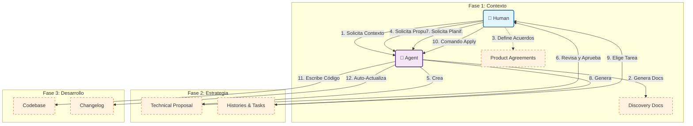

# QuinotoSpec: Berserker Edition (ALPHA)

> [!WARNING]
> **ARCHITECTURE EVOLUTION**
> Esta versión implementa los nuevos patrones de orquestación y memoria persistente descritos en la guía técnica.
>
> ### 🗺️ Roadmap
>
> **🪓 Berserker Edition (Q2 2026)**
> _Status: En Implementación (Fase 1: Estructura)_
> - **Orchestrator-Workers:** Delegación quirúrgica a subagentes.
> - **Engram Memory:** Persistencia de decisiones técnica via SQLite/MCP.
> - **Lazy Skills:** Inyección dinámica de conocimiento especializado.
>
> **👻 Posesion Edition (TBA)**
> _Status: Concepto_
> - **Battle Frenzy (Swarm Mode):** Ejecución de múltiples agentes en paralelo para tareas masivas.
> - **Blood-Bond:** Predicción proactiva de User Stories e intenciones basada en el comportamiento del desarrollador.
>
> **🛡️ Warband: Falange Edition (TBA)**
> _Status: Futuro_
> - **Class System:** Roles de agentes especializados (Scout, Skald, Blacksmith) que trabajan en formación cerrada.
> - **Shield Wall:** Testing defensivo y validación cruzada entre agentes antes de mergear.
>
> **⚔️ Warband: Hird Edition (TBA)**
> _Status: Visionario_
> - **War Council:** Resolución de conflictos lógica y mediación estratégica entre equipos grandes.
> - **Alliance Integration (Multi-Repo):** Contexto compartido federado para arquitecturas distribuidas de gran escala.

<div align="center">
  
</div>

# Guía de Desarrollo Guiado por IA con QuinotoSpec

Esta guía explica cómo utilizar la metodología **QuinotoSpec** y sus agentes asociados para desarrollar software de manera estructurada, eficiente y documentada.

## Instalación

1.  **Obtén el paquete**: Asegúrate de tener la carpeta `quinotospec-package` disponible.
2.  **Ejecuta el instalador**: Desde una terminal, corre el script.
    
    ```bash
    # Da permisos de ejecución
    chmod +x quinotospec-package/install.sh

    # Ejecuta
    ./quinotospec-package/install.sh
    ```

    El script te pedirá **dónde quieres instalar el agente**.
    - Puedes presionar `Enter` para instalar en el directorio actual.
    - O escribir una ruta específica (ej. `~/proyectos/mi-nuevo-app`) y el script la creará si no existe.

### Soporte para Cursor
Si utilizas el editor **Cursor**, puedes usar el parámetro `--cursor` para que la instalación sea compatible con la estructura de Cursor:

```bash
./quinotospec-package/install.sh --cursor
```

**¿Qué cambia con este parámetro?**
- Instala la configuración en la carpeta `.cursor/` en lugar de `.agent/`.
- Renombra la subcarpeta `workflows` a `commands` para que Cursor la reconozca automáticamente como [custom commands](https://docs.cursor.com/context/rules-for-ai#custom-commands).

## Filosofía: "Proposal First" & "Context Slicing"

La metodología se basa en dos pilares fundamentales para maximizar la eficacia de la IA:

1.  **Proposal First**: La regla de oro. **Antes de escribir código, escribe una propuesta.** Esto evita el "código espagueti" y asegura que cada cambio tenga un propósito y diseño aprobado.

2.  **Context Slicing**: El contexto se "rebana" y refina progresivamente.
    - **Discovery**: Contexto Global (Todo el proyecto).
    - **Proposal**: Contexto de la Iniciativa (Solo lo relevante para el feature).
    - **User Histories**: Contexto del Valor (El "qué" y "para quién" funcional).
    - **Task**: Contexto Atómico (Instrucciones precisas para una acción).
    
    *Al achicar el foco en cada etapa, reducimos las alucinaciones y aumentamos la precisión.*

## Flujo de Trabajo (Workflow)

El ciclo de vida de una nueva funcionalidad sigue estos pasos estrictos, apoyados por workflows automatizados del agente:

### 1. Discovery
Si no conoces el estado actual del proyecto o vas a tocar un área compleja.

- **Comando**: `@quinotospec.discovery`
- **Output**: Genera documentación fresca en `.quinoto-spec/discovery/` (Arquitectura, Endpoints, etc.).
- **Objetivo**: Que el agente tenga contexto real antes de proponer nada.

### 2. Crear Propuesta Técnica
Define la solución a alto nivel.

- **Comando**: `@quinotospec.create-proposal`
- **Output**: Crea `.quinoto-spec/proposals/{slug}/proposal.md`.
- **Acción**:
    1.  El agente te pedirá la descripcion de la propuesta. (puedes inyectar documentcion en formato markdown)
    2.  Registrará automáticamente un **Prefijo Único** (ej. `AUTH`, `TPGO`) en `.quinoto-spec/prefix-registry.md`.
    3.  Generará el archivo base de la propuesta.

### 3. Generar Historias de Usuario
Desglosa la propuesta en requerimientos de valor.

- **Comando**: `@quinotospec.create-user-histories`
- **Parámetro**: Nombre de la carpeta de la propuesta (slug).
- **Output**: `.quinoto-spec/proposals/{slug}/user-histories.md`.
- **Detalle**: Crea items funcionales con IDs basados en el prefijo (ej. `US-AUTH-01`).

### 4. Generar Tareas Técnicas
Convierte historias en pasos ejecutables para el desarrollador (o el agente).

- **Comando**: `@quinotospec.create-tasks`
- **Parámetro**: ID de la Historia de Usuario (ej. `US-AUTH-01`).
- **Output**: `.quinoto-spec/proposals/{slug}/{US_ID}_tasks.md`.
- **Detalle**: Crea una lista de chequeo técnica (ej. `TSK-AUTH-001: Crear modelo User`).

### 5. Implementación (Apply)
Ejecuta las tareas una por una.

- **Comando**: `@quinotospec.apply`
- **Input**: Descripción de la tarea o ID (ej. "Implementar TSK-AUTH-001").
- **Acción**:
    1.  El agente lee el contexto (Discovery + Propuesta).
    2.  Genera un branch (si aplica).
    3.  Escribe el código y los tests.
    4.  **Actualiza el Changelog automáticamente**.

### 6. Utilidades Adicionales

#### Archive (Limpieza)
Mueve elementos finalizados a un estado de "archivo" para limpiar el workspace.

- **Comando**: `@quinotospec.archive`
- **Parámetro**: `TARGET` (Slug de propuesta, nombre de archivo de historias o tareas).
- **Acción**: Renombra el elemento agregándole un prefijo `__` (ej. `__auth-module`, `__user-histories.md`, `__US-AUTH-001_tasks.md`) para indicarlo como archivado.

#### Read PDF
Ingesta documentación externa en formato PDF para darle contexto al agente.

- **Comando**: `@quinotospec.readpdf`
- **Parámetros**:
    - `DOCUMENT_PATH`: Ruta al archivo PDF.
    - `NOMBRE_DEL_ARCHIVO`: Nombre del archivo de salida (sin extensión).
- **Acción**: Lee el PDF, extrae el texto, lo formatea y guarda el contenido en un archivo Markdown.

#### Dashbord de Proyecto (Status)
Mantén una visión clara del progreso y el valor generado.

- **Comando**: `@quinotospec.status`
- **Output**: Genera/Actualiza `PROJECT_STATUS.md` en la raíz.
- **Acción**: Escanea las propuestas y el changelog para calcular el progreso porcentual y el tiempo total ahorrado por la IA.

### 7. Habilidades (Skills)

El agente cuenta con "Skills" especializadas que ejecutan tareas complejas de forma autónoma:

- **Generate Github Branch**: Crea branches siguiendo el estándar de nombrado del equipo automáticamente.
- **File Creation**: Estandariza la creación de archivos, asegurando que scripts temporales y documentos sigan las normas.
- **Mark Done**: Automatiza el cierre de tareas. Cuando una tarea se completa, renombra recursivamente archivos y carpetas para reflejar su estado final.
- **Read PDF**: Motor de extracción de texto para documentos PDF, usado por el workflow `readpdf`.
- **Update Changelog**: Mantiene el `docs/quinoto-spec-changelog.md` actualizado con cada cambio relevante, calculando tiempos (si están disponibles) y categorizando cambios.

## Mantenimiento y Reglas

### Integridad de la Especificación (Agent Only)
**CRÍTICO**: El contenido de la carpeta `.quinoto-spec/` y el archivo `docs/quinoto-spec-changelog.md` son administrados **EXCLUSIVAMENTE** por el agente.
- **NUNCA** edites estos archivos manualmente.
- Si necesitas corregir o actualizar algo en la especificación, pídeselo al agente (ej. "Actualiza el changelog", "Refina la propuesta").
- Esto garantiza que la "memoria" del sistema no se corrompa por intervenciones humanas no registradas.

### Changelog Automatizado
Los workflows usan la skill `quinotospec-update-changelog` para mantener el historial ordenado y consistente. El agente debe ser el único escritor de este archivo.

### Reglas del Proyecto (Compulsory Rules)
El sistema impone reglas estrictas para garantizar la calidad. El agente tiene instrucciones de detenerse si no se cumplen:

#### 1. Gestión del Changelog
- **Regla**: Nunca editar manualnente.
- **Acción**: El agente usará siempre la skill `quinotospec-update-changelog` tras completar tareas relevantes.

#### 2. Gestión de Prefijos e IDs
- **Regla**: Todo trabajo debe estar trazado bajo una Propuesta con un Prefijo registrado.
- **Acción**: Antes de crear historias o tareas, el agente verificará `.quinoto-spec/prefix-registry.md`. Si el prefijo no existe, no se permite avanzar.

#### 3. Product Agreement Check (BLOQUEANTE)
- **Regla**: No se arranca una propuesta sin definición de producto.
- **Acción**: Antes de crear una propuesta, el agente **lee** `.quinoto-spec/discovery/07-product-and-agreements.md`.
    - Si el archivo está vacío o tiene placeholders -> **STOP**.
    - El agente te dirá: *"No puedo crear la propuesta porque no se han definido los Acuerdos de Producto"*.
    - **Solución**: Debes llenar ese archivo con la Visión, DoR y DoD antes de pedir la propuesta.

---

## Flujo de Interacción (Humano vs Agente)



---

## Licencia

Este proyecto se distribuye bajo la licencia **MIT**. Consulta el archivo [LICENSE](LICENSE) para más detalles.

`QuinotoSpec` es un proyecto de código abierto y las contribuciones son bienvenidas.
