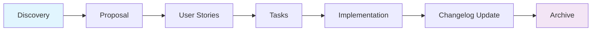
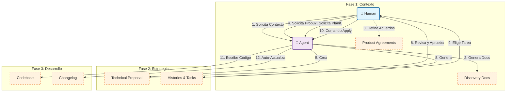

# QuinotoSpec: Berserker Edition 🪓

> [!NOTE]
> **ESTADO: PRODUCCIÓN / ESTABLE**
> Esta es la versión oficial diseñada para entornos de agentes avanzados y equipos de alto rendimiento.
>
> **Nota:** Estamos trabajando activamente en la integración nativa con GitHub Copilot.

## 📋 Tabla de Contenido

- [Instalación](#instalación)
  - [Soporte para OpenCode](#soporte-para-opencode)
  - [Soporte para Cursor](#soporte-para-cursor)
  - [Soporte para Cline](#soporte-para-cline)
  - [Dependencias del Instalador](#dependencias-del-instalador)
- [Filosofía: "Proposal First" & "Context Slicing"](#filosofía-proposal-first--context-slicing)
- [Flujo de Trabajo (Workflow)](#flujo-de-trabajo-workflow)
  - [1. Discovery](#1-discovery)
  - [1.b Stack Detect](#1b-stack-detect)
  - [1.c Stack Discovery (Multi-Servicio)](#1c-stack-discovery-multi-servicio)
  - [2. Crear Propuesta Técnica](#2-crear-propuesta-técnica)
  - [3. Generar Historias de Usuario](#3-generar-historias-de-usuario)
  - [4. Generar Tareas Técnicas](#4-generar-tareas-técnicas)
  - [5. Implementación (Apply)](#5-implementación-apply)
  - [6. Utilidades Adicionales](#6-utilidades-adicionales)
    - [Blood-Bond (Predicción Proactiva)](#blood-bond-predicción-proactiva)
    - [Onboarding (Nuevos Integrantes)](#onboarding-nuevos-integrantes)
  - [7. Habilidades (Skills)](#7-habilidades-skills)
  - [8. Agents Especializados](#8-agents-especializados)
- [Ejemplo de Estructura de Proyecto](#ejemplo-de-estructura-de-proyecto)
- [Mantenimiento y Reglas](#mantenimiento-y-reglas)
- [Guía de Solución de Problemas](#guía-de-solución-de-problemas)
- [Flujo de Interacción (Humano vs Agente)](#flujo-de-interacción-humano-vs-agente)
- [Licencia](#licencia)
- [Roadmap](#roadmap)

---

### 🗺️ Roadmap

**🪓 Berserker Edition (Actual)**
_Status: 🟢 Estable / Producción_
- ⏸️ **Runic Memory:** Memoria semántica del proyecto usando bases de datos vectoriales. _(Standby)_
- ✅ **Mjolnir Refactor:** Capacidad de reescribir módulos enteros bajo demanda para limpiar deuda técnica. _(Completado)_
- ✅ **Code Review Workflow** (`@quinotospec.review`): Revisión de branches contra criterios de aceptación, tests y convenciones del stack. _(Completado)_
- ✅ **Sprint Planning Workflow** (`@quinotospec.sprint`): Generación de sprint plans con capacidad, prioridades y dependencias. _(Completado)_
    - Separado en 3 workflows: init, create, plan
- ✅ **Validate Skill** (`quinotospec-validate`): Checks de sistema reutilizables como precondición para workflows críticos. _(Completado)_
- ✅ **Refresh Discovery** (`@quinotospec.refresh-discovery`): Discovery incremental — detecta cambios y actualiza solo los archivos afectados. _(Completado)_
- ✅ **Dependency Graph** (`@quinotospec.dependency-graph`): Mapa de dependencias inter-servicio con detección de contract drift. _(Completado)_
- ✅ **Agent Train** (`@quinotospec.agent-train`): Asistencia para crear agentes abstractos especializados con sugerencias basadas en discovery y estructura del proyecto. _(Completado)_

**👻 Posesion Edition (TBA)**
_Status: Concepto_
- **Battle Frenzy (Swarm Mode):** Ejecución de múltiples agentes en paralelo para tareas masivas.
- **Blood-Bond:** Predicción proactiva de User Stories e intenciones basada en el comportamiento del desarrollador.

**🛡️ Warband: Falange Edition (TBA)**
_Status: Futuro_
- **Class System:** Roles de agentes especializados (Scout, Skald, Blacksmith) que trabajan en formación cerrada.
- **Shield Wall:** Testing defensivo y validación cruzada entre agentes antes de mergear.

**⚔️ Warband: Hird Edition (TBA)**
_Status: Visionario_
- **War Council:** Resolución de conflictos lógica y mediación estratégica entre equipos grandes.
- **Alliance Integration (Multi-Repo):** Contexto compartido federado para arquitecturas distribuidas de gran escala.

<div align="center">
  
</div>

## Introducción

Esta guía explica cómo utilizar la metodología **QuinotoSpec** y sus agentes asociados para desarrollar software de manera estructurada, eficiente y documentada. QuinotoSpec implementa el flujo de trabajo "Proposal First" / "Context Slicing" para maximizar la precisión de la IA y minimizar las alucinaciones en el desarrollo asistido.

## Instalación

1.  **Obtén el paquete**: Asegúrate de tener la carpeta `quinotospec-package` disponible (clonar el master en tu local).
2.  **Ejecuta el instalador**: Desde una terminal, corre el script.
    
    ```bash
    # Da permisos de ejecución
    chmod +x quinotospec-package/install.sh

    # Ejecuta
    ./quinotospec-package/install.sh
    ```

    El script te pedirá **dónde quieres instalar el agente**.
    - Puedes presionar `Enter` para instalar en el directorio actual.
    - O escribir una ruta específica (ej. `~/proyectos/mi-nuevo-app`) y el script la creará si no existe.
    - Además, copia `AGENTS.md` a la raíz del proyecto para que el agente tenga acceso a las instrucciones.

### Soporte para OpenCode
Si utilizas **OpenCode**, puedes usar el parámetro `--opencode` para que la instalación sea compatible:

```bash
./quinotospec-package/install.sh --opencode
```

**¿Qué cambia con este parámetro?**
- Instala la configuración en la carpeta `.opencode/` en lugar de `.agent/`.
- Ajusta la estructura para que OpenCode reconozca los workflows automáticamente.
- Copia `AGENTS.md` a la raíz del proyecto.

### Soporte para Cursor
Si utilizas el editor **Cursor**, puedes usar el parámetro `--cursor` para que la instalación sea compatible con la estructura de Cursor:

```bash
./quinotospec-package/install.sh --cursor
```

**¿Qué cambia con este parámetro?**
- Instala la configuración en la carpeta `.cursor/` en lugar de `.agent/`.
- Renombra la subcarpeta `workflows` a `commands` para que Cursor la reconozca automáticamente como [custom commands](https://docs.cursor.com/context/rules-for-ai#custom-commands).
- Copia `AGENTS.md` a la raíz del proyecto.

### Soporte para Cline
Si utilizas **Cline**, puedes usar el parámetro `--cline` para que la instalación sea compatible:

```bash
./quinotospec-package/install.sh --cline
```

**¿Qué cambia con este parámetro?**
- Instala Skills en `.cline/skills/`
- Instala Rules en `.clinerules/`
- Instala Workflows en `.clinerules/workflows/`
- Copia `AGENTS.md` a la raíz del proyecto

### Dependencias del Instalador

El script `install.sh` requiere las siguientes dependencias del sistema:

| Dependencia | Propósito | Verificación |
|-------------|-----------|--------------|
| **Bash** | Ejecutar el script de instalación | `bash --version` (4.0+) |
| **Git** | Clonar repositorio (si se usa opción de clonado) | `git --version` |
| **curl** o **wget** | Descargar dependencias (si es necesario) | `curl --version` o `wget --version` |
| **Python 3** | Para algunas skills avanzadas (ej. Read PDF) | `python3 --version` (3.8+) |
| **pip** | Instalar paquetes Python (pdfplumber, etc.) | `pip3 --version` |

**Nota**: La mayoría de las dependencias son opcionales. El instalador funcionará con Bash y Git como mínimo. Las dependencias Python solo son necesarias para skills específicas como `quinotospec-readpdf`.

## Filosofía: "Proposal First" & "Context Slicing"

La metodología se basa en dos pilares fundamentales para maximizar la eficacia de la IA:

1.  **Proposal First**: La regla de oro. **Antes de escribir código, escribe una propuesta.** Esto evita el "código espagueti" y asegura que cada cambio tenga un propósito y diseño aprobado.

2.  **Context Slicing**: El contexto se "rebana" y refina progresivamente.
    - **Discovery**: Contexto Global (Todo el proyecto).
    - **Proposal**: Contexto de la Iniciativa (Solo lo relevante para el feature).
    - **User Histories**: Contexto del Valor (El "qué" y "para quién" funcional).
    - **Task**: Contexto Atómico (Instrucciones precisas para una acción).
    
    *Al achicar el foco en cada etapa, reducimos las alucinaciones y aumentamos la precisión.*

## Flujo de Trabajo (Workflow)

El ciclo de vida de una nueva funcionalidad sigue estos pasos estrictos, apoyados por workflows automatizados del agente:

### 1. Discovery
Si no conoces el estado actual del proyecto o vas a tocar un área compleja.

- **Comando**: `@quinotospec.discovery`
- **Output**: Genera documentación fresca en `.quinoto-spec/discovery/` (Arquitectura, Endpoints, etc.).
- **Objetivo**: Que el agente tenga contexto real antes de proponer nada.
- **Ejemplo**: `"Ejecuta @quinotospec.discovery en este directorio para entender la arquitectura base de datos."`

### 1.b Stack Detect
Identifica automáticamente el technology stack del proyecto (lenguajes, frameworks, testing, DevOps) archivos de configuración.

- **Comando**: `@quinotospec-stack-detect`
- **Acción**: Escanea package.json, go.mod, requirements.txt, etc. y genera perfil de stack.
- **Detalle**: Detecta Python, JS/TS, Go, Rust, PHP, Java y sus frameworks asociados.
- **Ejemplo**: `"Ejecuta @quinotospec-stack-detect para identificar las tecnologías de este proyecto."`

### 1.c Stack Discovery (Multi-Servicio)

- **Comando**: `@quinotospec.stack-discovery`
- **Acción**: Lee los sub-proyectos, detecta inconsistencias tecnológicas y genera un discovery global consolidado.
- **Detalle**: Funciona como un "Discovery de Discoveries" en 3 pasos clave:
    1. **Gatekeeper de Frescura**: Verifica el `Discovery Date` de cada servicio. Si alguno tiene >30 días, bloquea y sugiere actualizarlo con `@quinotospec.refresh-discovery`.
    2. **Consolidación Inteligente**: No solo une archivos, sino que cruza datos: detecta inconsistencias de versión entre stacks, unifica la arquitectura en un solo diagrama Mermaid, y busca modelos de datos duplicados entre servicios.
    3. **Dependency Graph**: Invoca automáticamente el análisis de dependencias para mapear llamadas HTTP cruzadas y alertar sobre Contract Drift.
- **Ejemplo**: `"Ejecuta @quinotospec.stack-discovery para unificar la documentación de todos los microservicios del proyecto."`

### 2. Crear Propuesta Técnica
Define la solución a alto nivel.

- **Comando**: `@quinotospec.create-proposal`
- **Output**: Crea `.quinoto-spec/proposals/{slug}/proposal.md`.
- **Acción**:
    1.  El agente te pedirá la descripcion de la propuesta. (puedes inyectar documentcion en formato markdown)
    2.  Registrará automáticamente un **Prefijo Numérico** secuencial (ej. `001`, `002`, `010`) en `.quinoto-spec/prefix-registry.md`.
    3.  Generará el archivo base de la propuesta, incluyendo el campo `Servicios Afectados` para arquitecturas distribuidas.
- **Ejemplo**: `"Crea una propuesta técnica con @quinotospec.create-proposal. El objetivo es migrar la pasarela de pagos a Stripe."`

### 3. Generar Historias de Usuario
Desglosa la propuesta en requerimientos de valor.

- **Comando**: `@quinotospec.create-user-histories`
- **Parámetro**: Nombre de la carpeta de la propuesta (slug).
- **Output**: `.quinoto-spec/proposals/{slug}/user-histories.md`.
- **Detalle**: Crea items funcionales con su correspondiente columna `Servicio` para trazabilidad multi-repositorio.
- **Ejemplo**: `"Genera historias de usuario con @quinotospec.create-user-histories referenciando la propuesta 'stripe-migration'."`

### 4. Generar Tareas Técnicas
Convierte historias en pasos ejecutables para el desarrollador (o el agente).

- **Comando**: `@quinotospec.create-tasks`
- **Parámetros**: 
    - `PROPOSAL_SLUG`: Nombre de la carpeta de la propuesta.
    - `USER_STORY_ID`: (Opcional) ID de la historia de usuario (ej. `US-AUTH-01`). Solo requerido si se usa `--single`.
- **Flags**:
    - `--single` `-s`: Genera tareas solo para una historia específica (contrario al comportamiento por defecto).
    - Por defecto: Genera tareas para TODAS las historias de usuario pendientes de la propuesta.
- **Output**: `.quinoto-spec/proposals/{slug}/{US_ID}_tasks.md`.
- **Detalle**: Crea una lista de chequeo técnica con columna `Servicio` heredada de la historia de usuario. Soporta merge inteligente: no sobreescribe tareas existentes, solo agrega las nuevas.
- **Ejemplos**: 
    - `"Genera las tareas técnicas para todas las historias de la propuesta 'stripe-migration' usando @quinotospec.create-tasks."`
    - `"Genera solo la tarea para 'US-STRP-001' usando @quinotospec.create-tasks --single."`

### 5. Implementación (Apply)
Ejecuta las tareas una por una.

- **Comando**: `@quinotospec.apply`
- **Input**: Descripción de la tarea o ID (ej. "Implementar TSK-AUTH-001").
- **Acción**:
    1.  El agente lee el contexto (Discovery + Propuesta).
    2.  **Confirmación requerida**: Antes de crear un branch, pregunta al usuario si desea crear uno nuevo. Si no quiere, se trabaja en la rama actual.
    3.  Escribe el código y los tests.
    4.  **Actualiza el Changelog automáticamente**.
    5.  **Sugiere la siguiente tarea**: Después de completar, busca la próxima tarea pendiente según orden y dependencias, y pregunta al usuario si desea continuar.
- **Ejemplo**: `"Aplica la tarea 'TSK-STRP-001' usando @quinotospec.apply. Asegúrate de actualizar los tests de integración."`

### 6. Utilidades Adicionales

#### Mjolnir Refactor
Estrategia agresiva para reescribir módulos enteros con alta deuda técnica.

- **Comando**: `@quinotospec.mjolnir-refactor`
- **Acción**: Mapea impacto, analiza código legacy, genera propuesta de refactor, user stories y tareas de reemplazo paso a paso.
- **Ejemplo**: `"Aplica @quinotospec.mjolnir-refactor sobre la carpeta src/legacy-billing para migrarla a arquitectura hexagonal."`

#### Archive (Limpieza)
Mueve elementos finalizados a un estado de "archivo" para limpiar el workspace.

- **Comando**: `@quinotospec.archive`
- **Parámetro**: `TARGET` (Slug de propuesta, nombre de archivo de historias o tareas).
- **Acción**: Mueve el elemento a la carpeta `_archived/`.
- **Ejemplo**: `"Ejecuta @quinotospec.archive sobre la propuesta 'stripe-migration' porque ya se verificó en PROD."`

#### Read PDF
Ingesta documentación externa en formato PDF para darle contexto al agente.

- **Comando**: `@quinotospec.readpdf`
- **Acción**: Lee un PDF, extrae el texto usando Python/pdfplumber, y lo guarda en `.quinoto-spec/docs/`.
- **Ejemplo**: `"Lee el archivo ./docs/api-guide.pdf con @quinotospec.readpdf y guárdalo como 'guia-api'."`

#### Dashboard de Proyecto (Status)
Mantén una visión clara del progreso y el valor generado.

- **Comando**: `@quinotospec.status`
- **Acción**: Escanea propuestas y changelog, calculando velocidad de IA, alertas de bloqueos y descubrimientos caducados.
- **Ejemplo**: `"Muestra cómo venimos ejecutando @quinotospec.status para ver la velocidad del último sprint."`

#### Refresh Discovery
Actualiza solo los archivos de discovery afectados por cambios recientes.

- **Comando**: `@quinotospec.refresh-discovery`
- **Acción**: Detecta qué archivos cambiaron desde la `Discovery Date` y actualiza únicamente las partes impactadas.
- **Ejemplo**: `"Actualiza el discovery de la arquitectura porque metimos cambios en la BD, usa @quinotospec.refresh-discovery."`

#### Dependency Graph
Mapea las dependencias inter-servicio y detecta contract drift.

- **Comando**: `@quinotospec.dependency-graph`
- **Acción**: Analiza llamadas HTTP cross-servicio y recursos compartidos. Genera un mapa Mermaid y alerta sobre endpoints desalineados.
- **Ejemplo**: `"Corre @quinotospec.dependency-graph para ver qué servicios dependen todavía del viejo MS de usuarios."`

#### Agent Train
Ayuda al desarrollador a crear agentes abstractos especializados basándose en el discovery y estructura del proyecto.

- **Comando**: `@quinotospec.agent-train`
- **Parámetros**:
    - `AGENT_NAME`: Nombre del agente a crear (opcional)
    - `--suggest`: Modo de sugerencias basadas en análisis
- **Acción**:
    1. Refresca el discovery automáticamente.
    2. Analiza la estructura del proyecto (directorios, stack, sub-módulos).
    3. Genera sugerencias de agentes potenciales.
    4. Guía al usuario para definir el propósito y responsabilidades del agente.
    5. Opcionalmente guarda el perfil en `.quinoto-spec/agents/`.
- **Nota**: No genera perfiles automáticamente, ayuda al usuario a crearlos con sugerencias basadas en código real.
- **Ejemplo**: `"Ayúdame a crear un agente para el área de autenticación usando @quinotospec.agent-train --suggest"`
Revisa un branch contra los criterios de aceptación.

- **Comando**: `@quinotospec.review`
- **Acción**: Verifica alineación con el DoD, tests, convenciones de stack (archivos permitidos) antes de mergear.
- **Ejemplo**: `"Haz un code review a la rama 'feature/TSK-STRP-001' usando @quinotospec.review."`

#### Sprint Planning
Genera un plan de acción a corto plazo y lo organiza en carpetas dedicadas. El flujo de sprints se divide en 3 pasos:

- **Paso 1 - Inicializar**: `@quinotospec.sprints.init`
    - Crea la carpeta `.quinoto-spec/sprints/` si no existe.
    - Genera `base-config.yml` con la configuración del equipo (miembros, roles, velocidad).
    - **Detiene ejecución** si la configuración está incompleta hasta que el usuario la complete.

- **Paso 2 - Crear Sprint**: `@quinotospec.sprint.create`
    - **Parámetros**: `SPRINT_ID` (ej. `1`), `NOMBRE_SPRINT` (ej. `Integración API`)
    - Crea la carpeta `.quinoto-spec/sprints/sprint-{{ID}}/`.
    - Genera `sprint-config.yml` con fechas, duración y prioridad de propuestas.

- **Paso 3 - Planificar**: `@quinotospec.sprint.plan`
    - **Parámetro**: `SPRINT_ID`
    - Lee la configuración base y del sprint.
    - Calcula capacidad del equipo y selecciona tareas según prioridad.
    - Genera `sprint-plan.md` con las tareas asignadas.

- **Orquestador**: `@quinotospec.sprint`
    - Ejecuta los 3 pasos anteriores en secuencia.
    - **Parámetros**: `SPRINT_ID`, `NOMBRE_SPRINT`
    - Ejemplo: `"Arma el sprint 1 'Integración API' con @quinotospec.sprint."`

**Estructura de archivos generada:**
```
.quinoto-spec/sprints/
├── base-config.yml                    # Configuración del equipo
└── sprint-{{ID}}/
    ├── sprint-config.yml               # Configuración del sprint
    ├── sprint-plan.md                  # Plan de tareas
    └── proposals/                     # Propuestas distribuidas
```

#### Distribute Proposal
Distribuye los artefactos de una propuesta central hacia los microservicios correspondientes.

- **Comando**: `@quinotospec.distribute`
- **Parámetros**: `SPRINT_ID`, `PROPOSAL_SLUG`.
- **Acción**: Lee la columna `Servicio` de historias y tareas filtradas por el sprint indicado, y copia los archivos a cada sub-proyecto:
    - `proposal.md` - Propuesta filtrada para el componente
    - `user-histories.md` - Historias de usuario del componente
    - `<US_ID>_tasks.md` - Tareas técnicas del componente
- **Estructura por servicio**:
  ```
  <servicio>/.quinoto-spec/sprints/sprint-{{ID}}/proposals/{{SLUG}}/
  ├── proposal.md
  ├── user-histories.md
  └── US-XXX_tasks.md
  ```
- **Ejemplo**: `"Distribuye las tareas de 'auth-standardization' para el sprint 1 usando @quinotospec.distribute."`

#### Blood-Bond (Predicción Proactiva)
Analiza patrones de trabajo y predice siguientes acciones proactivamente. Forma un "vínculo de sangre" con tu patrón de trabajo.

- **Comando**: `@quinotospec.blood-bond`
- **Parámetros**:
    - `--suggest`: Solo generar sugerencias
    - `--profile`: Solo mostrar tu perfil de trabajo
    - `--alerts`: Solo alertas de estancamiento
- **Acción**:
    1. Analiza changelog, prefix registry, proposals y tasks
    2. Detecta secuencias de trabajo (ej. AUTH → REWA → INTE)
    3. Predice qué viene después basado en tu historial
    4. Alerta cuando detecta inactividad prolongada
- **Output**: `.quinoto-spec/blood-bond/suggestions.md`
- **Ejemplo**: `"Ejecuta @quinotospec.blood-bond para ver qué debería hacer después."`

#### Onboarding (Nuevos Integrantes)
Genera un documento de onboarding personalizado por rol para nuevos integrantes del equipo.

- **Comando**: `@quinotospec.onboard`
- **Parámetros**:
    - `ROL`: Rol del integrante (general, developer, product, support, simple, o personalizado)
- **Acción**:
    1. Lee discovery, proposals y estado actual del proyecto
    2. Genera documento contextualizado según el rol
    3. Incluye setup, arquitectura, flujo de trabajo y contactos
- **Roles Disponibles**:
    - `general`: Vista balanceada del proyecto
    - `developer`: Foco técnico (arquitectura, setup, código, tests)
    - `product`: Foco en producto (qué se construye, por qué, roadmap)
    - `support`: Foco en soporte (comportamiento, endpoints, incidentes)
    - `simple`: Lenguaje extremadamente simple, sin jerga técnica
- **Output**: `.quinoto-spec/onboarding-{{ROL}}-{{FECHA}}.md`
- **Ejemplo**: `"Genera un onboarding para un nuevo desarrollador con @quinotospec.onboard developer."`

### 7. Habilidades (Skills)

El agente cuenta con "Skills" especializadas que ejecutan tareas complejas de forma autónoma:

#### Skills Básicas

- **Generate Github Branch**: Crea branches siguiendo el estándar `feature/{{TASK_ID}}-descripcion-kebab-case` automáticamente, detectando la rama base y haciendo push. **Requiere confirmación del usuario antes de ejecutar**.
- **File Creation**: Estandariza la creación de archivos, asegurando que scripts temporales y documentos sigan las normas.
- **Stack Detect**: Identifica el technology stack del proyecto (lenguajes, frameworks, testing) analizando archivos de configuración.
- **Mark Done**: Automatiza el cierre de tareas. Marca el checkbox `[x]`, mueve artefactos completados a `_archived/`, y actualiza el changelog automáticamente.
  - Soporta modo **bulk** (`--bulk`) para múltiples tareas
  - Soporta modo **force** (`--force`) para forzar archive
- **Read PDF**: Motor de extracción de texto para documentos PDF. Genera un script temporal, extrae el contenido y lo guarda en `.quinoto-spec/docs/`.
- **Update Changelog**: Mantiene el `.quinoto-spec/quinoto-spec-changelog.md` actualizado con cada cambio relevante, calculando tiempos y categorizando cambios.
- **Validate**: Ejecuta checks de sistema (discovery, prefix-registry, changelog, propuestas) como precondición antes de workflows críticos.

#### Skills Avanzadas (Gobernanza)

- **Rules Enforce**: Ejecuta y hace cumplir las reglas de `quinotospec-rules.md`. Detiene workflows que violen las reglas.
  - Modo `strict`: Detiene si regla crítica falla
  - Modo `warning`: Solo advierte
  - Uso: `/rules-enforce --mode strict --check changelog,prefix,product-agreement`
- **Metrics**: Calcula métricas de compliance y productividad del proyecto.
  - Changelog compliance, prefix usage, branch naming, etc.
  - Uso: `/quinotospec-metrics --dashboard` o `/metrics --period month`
- **Syntax Validate**: Valida sintaxis y estructura de archivos QuinotoSpec antes de ejecutar workflows.
  - Valida proposals, user-stories, tasks, changelog, discovery, config
  - Uso: `/syntax-validate --type proposal --slug auth-jwt` o `--type all --strict`
- **Rollback**: Deshace cambios realizados por workflows cuando la validación falla o el usuario lo solicita.
  - Tipos: `changelog`, `proposal`, `user-story`, `task`, `full`
  - Uso: `/rollback --type proposal --slug auth-jwt --dry-run`

#### Integración Recomendada

```bash
# Pre-condición antes de workflows críticos
@quinotospec-validate --full

# Antes de aplicar código
@quinotospec-syntax-validate --type proposal --slug {{SLUG}}

# Después de completar tarea
@mark-done --task-id TSK-AUTH-001 --bulk TSK-AUTH-002,TSK-AUTH-003

# Métricas para retrospectives
@quinotospec-metrics --dashboard
```

### 8. Agents Especializados

QuinotoSpec incluye agents pre-configurados que pueden ser invocados para tareas específicas. Los agents se definen en `agent-dist/agents/` y pueden ser usados directamente o como subagents.

#### Agents Disponibles

| Agent | Descripción | Modelo | Modo | Herramientas |
|-------|-------------|--------|------|--------------|
| **router** | Router principal. Deriva a otros agents según el tipo de tarea | `mimo-v2-pro` | primary | - |
| **vision** | Analiza imágenes: facturas, fotos, capturas, documentos visuales | `mimo-v2-omni` | subagent | read |
| **coder-go** | Implementa código complejo, funciones, correcciones, refactoring | `mimo-v2-pro` | subagent | read, edit, bash |
| **coder-free** | Implementación de código (modelo gratuito) | - | subagent | read, edit, bash |
| **reviewer-go** | Revisión de código, análisis de calidad y sugerencias | `mimo-v2-pro` | subagent | read |
| **planner-go** | Diseño y planificación técnica, arquitectura de software | `mimo-v2-pro` | subagent | read |
| **analyst-free** | Análisis de datos y documentación (modelo gratuito) | - | subagent | read |
| **general-free** | Tareas generales (modelo gratuito) | - | subagent | read, edit, bash |
| **router_eco** | Router económico para tareas simples | - | primary | - |

#### Uso de Agents

```bash
# Usar el router principal (recomendado)
@router [descripción de la tarea]

# Usar un agent específico directamente
@vision "Analiza esta captura de pantalla y extrae los elementos de UI"
@coder-go "Implementa una función de validación de email en Python"
@reviewer-go "Revisa el archivo src/auth.js en busca de vulnerabilidades"
@planner-go "Diseña la arquitectura para un sistema de notificaciones"
```

#### Estructura de un Agent

```
agent-dist/agents/
├── router.md              # Router principal
├── vision.md              # Análisis de imágenes
├── coder-go.md            # Coding con Go/modelos Pro
├── coder-free.md          # Coding con modelos gratuitos
├── reviewer-go.md         # Code review
├── planner-go.md          # Planificación técnica
├── analyst-free.md        # Análisis de datos
├── general-free.md        # Tareas generales
└── router_eco.md          # Router económico
```

#### Crear Agent Personalizado

Puedes crear agents personalizados para tu proyecto:

1. Crea un archivo `.md` en `.quinoto-spec/agents/` (o en `agent-dist/agents/` para contribuir al paquete)
2. Sigue el formato YAML frontmatter:
```yaml
---
name: mi-agent
description: Descripción del agente
model: opencode-go/mimo-v2-pro  # o mimo-v2-omni, etc.
mode: subagent  # o primary
tools:
  read: true
  edit: true
  bash: false
---
```
3. Documenta el propósito, herramientas e instrucciones

**Nota**: Los agents en `agent-dist/agents/` son parte del paquete QuinotoSpec. Para proyectos específicos, usa `.quinoto-spec/agents/`.

## Ejemplo de Estructura de Proyecto

Después de ejecutar `/quinotospec.discovery` en tu proyecto, QuinotoSpec creará una estructura organizada en `.quinoto-spec/`. Aquí tienes un ejemplo completo de cómo se ve:

```
.tu-proyecto/
├── .quinoto-spec/                    # Directorio principal de QuinotoSpec
│   ├── discovery/                    # Documentación de descubrimiento (8 archivos)
│   │   ├── 00-stack-profile.md       # Stack tecnológico detectado
│   │   ├── 01-overview.md            # Resumen ejecutivo del proyecto
│   │   ├── 02-architecture.md        # Diagramas de arquitectura
│   │   ├── 03-endpoints-and-openapi.md # Endpoints y especificación OpenAPI
│   │   ├── 04-data-and-services.md   # Modelos de datos y servicios
│   │   ├── 05-devops-ci-security.md  # DevOps, CI/CD y seguridad
│   │   ├── 06-findings-and-recommendations.md # Hallazgos y deuda técnica
│   │   └── 07-product-and-agreements.md # Acuerdos de producto (DoR/DoD)
│   ├── proposals/                    # Propuestas técnicas
│   │   ├── 2024-04-15-auth-jwt/      # Ejemplo de propuesta
│   │   │   ├── proposal.md           # Propuesta técnica
│   │   │   ├── user-histories.md     # Historias de usuario
│   │   │   ├── US-AUTH-001_tasks.md  # Tareas para historia US-AUTH-001
│   │   │   └── _archived/            # Archivos completados
│   │   │       └── US-AUTH-001_tasks.md
│   │   └── _archived/                # Propuestas archivadas
│   │       └── 2024-03-01-old-feature/
│   ├── sprints/                      # Planificación de sprints
│   │   ├── base-config.yml           # Configuración del equipo
│   │   └── sprint-001/               # Sprint 1
│   │       ├── sprint-config.yml     # Configuración del sprint
│   │       ├── sprint-plan.md        # Plan de tareas
│   │       └── proposals/            # Propuestas distribuidas
│   ├── agents/                       # Perfiles de agentes especializados
│   ├── docs/                         # Documentación extraída (PDFs, etc.)
│   ├── blood-bond/                   # Análisis predictivo
│   │   ├── analysis.json             # Análisis de patrones
│   │   └── suggestions.md            # Sugerencias proactivas
│   ├── scripts/                      # Scripts temporales
│   │   └── temp_*.py                 # Scripts generados por skills
│   ├── prefix-registry.md            # Registro de prefijos de propuestas
│   └── quinoto-spec-changelog.md     # Historial de cambios
├── src/                              # Código fuente del proyecto
├── tests/                            # Tests
├── package.json                      # Configuración del proyecto
└── AGENTS.md                         # Instrucciones para agentes (copiado por instalador)
```

### Archivos Clave Explicados

| Archivo | Propósito | Ejemplo de Contenido |
|---------|-----------|----------------------|
| `00-stack-profile.md` | Stack tecnológico | Node.js 18, React 18, PostgreSQL 15 |
| `07-product-and-agreements.md` | DoR/DoD del equipo | "Definition of Ready: Historias > 3 puntos" |
| `prefix-registry.md` | Registro de prefijos | `AUTH`, `PAY`, `USER` |
| `proposal.md` | Propuesta técnica | "Migrar autenticación a JWT" |
| `user-histories.md` | Historias de usuario | "Como usuario, quiero loguearme con email" |
| `*_tasks.md` | Tareas técnicas | "TSK-AUTH-001: Implementar middleware JWT" |

### Flujo de Archivos


```mermaid
graph LR
    A[Discovery] --> B[Proposal]
    B --> C[User Stories]
    C --> D[Tasks]
    D --> E[Implementation]
    E --> F[Changelog Update]
    F --> G[Archive]
    
    style A fill:#e1f5fe
    style G fill:#f3e5f5
```

## Mantenimiento y Reglas

### Integridad de la Especificación (Agent Only)
**CRÍTICO**: El contenido de la carpeta `.quinoto-spec/` y el archivo `.quinoto-spec/quinoto-spec-changelog.md` son administrados **EXCLUSIVAMENTE** por el agente.
- **NUNCA** edites estos archivos manualmente.
- Si necesitas corregir o actualizar algo en la especificación, pídeselo al agente (ej. "Actualiza el changelog", "Refina la propuesta").
- Esto garantiza que la "memoria" del sistema no se corrompa por intervenciones humanas no registradas.

### Changelog Automatizado
Los workflows usan la skill `quinotospec-update-changelog` para mantener el historial ordenado y consistente. El agente debe ser el único escritor de este archivo.

### Reglas del Proyecto (Compulsory Rules)
El sistema impone reglas estrictas para garantizar la calidad. El agente tiene instrucciones de detenerse si no se cumplen:

#### 1. Gestión del Changelog
- **Regla**: Nunca editar manualmente.
- **Acción**: El agente usará siempre la skill `quinotospec-update-changelog` tras completar tareas relevantes.

#### 2. Gestión de Prefijos e IDs
- **Regla**: Todo trabajo debe estar trazado bajo una Propuesta con un Prefijo registrado.
- **Acción**: Antes de crear historias o tareas, el agente verificará `.quinoto-spec/prefix-registry.md`. Si el prefijo no existe, no se permite avanzar.

#### 3. Verificación de Acuerdos de Producto
- **Regla**: No crear propuestas si los acuerdos de producto no están definidos.
- **Acción**: Verificar `.quinoto-spec/discovery/07-product-and-agreements.md` antes de `/quinotospec.create-proposal`. Si tiene placeholders o está vacío → detener y notificar al usuario.

#### 4. Validación de Estado Antes de Archivar
- **Regla**: Antes de archivar, el estado debe ser `✅ Completada`.
- **Acción**: Verificar `**Estado:**` en proposal.md antes de mover a `_archived/`.

#### 5. Convención de Archivado
- **Regla**: Usar siempre carpeta `_archived/`, nunca prefijo `__`.
- **Acción**: Mover a `.quinoto-spec/proposals/{{SLUG}}/_archived/` o `.quinoto-spec/proposals/_archived/{{SLUG}}/`.

#### 6. Branch Naming Convention
- **Regla**: Formato `feature/{{TASK_ID}}-descripcion`.
- **Acción**: Crear branch solo si sigue este formato.

#### 7. Aprobación de Config Crítica
- **Regla**: Nunca modificar sin consentimiento explícito.
- **Archivos protegidos**: `base-config.yml`, `sprint-{{ID}}/sprint-config.yml`, `mjolnir-refactor.yml`.

---

## Guía de Solución de Problemas

### Problemas de Instalación

| Problema | Causa Común | Solución |
|----------|-------------|----------|
| **"Permission denied"** al ejecutar install.sh | Script sin permisos de ejecución | `chmod +x quinotospec-package/install.sh` |
| **"Bash not found"** | Bash no instalado o no en PATH | Instalar Bash: `sudo apt install bash` (Linux) o `brew install bash` (macOS) |
| **Directorio no encontrado** | Ruta incorrecta al ejecutar | Verificar que estás en el directorio correcto con `pwd` |
| **"Git not found"** | Git no instalado | Instalar Git: `sudo apt install git` (Linux) o `brew install git` (macOS) |

### Problemas de Ejecución

| Problema | Causa Común | Solución |
|----------|-------------|----------|
| **"No se encontró .quinoto-spec/discovery/"** | Discovery no ejecutado | Ejecutar `/quinotospec.discovery` primero |
| **"Prefijo no registrado"** | Prefijo no en prefix-registry.md | Registrar prefijo con `/quinotospec.create-proposal` o editar manualmente |
| **"Changelog desactualizado"** | Cambios no registrados | Ejecutar `/quinotospec-update-changelog` |
| **Workflows no reconocidos** | Instalación incorrecta para el IDE | Reinstalar con flag correcto: `--opencode`, `--cursor`, o `--cline` |

### Problemas de Agentes

| Problema | Causa Común | Solución |
|----------|-------------|----------|
| **Agente no responde a comandos** | AGENTS.md no copiado | Verificar que `AGENTS.md` está en la raíz del proyecto |
| **"Discovery obsoleto"** | Discovery > 30 días | Ejecutar `/quinotospec.refresh-discovery` |
| **"Conflicto en propuestas"** | Solapamiento de alcance | Revisar `.quinoto-spec/proposals/` para conflictos |
| **"Tests fallan"** | Stack no detectado correctamente | Ejecutar `/quinotospec-stack-detect` y verificar `00-stack-profile.md` |

### Comandos de Diagnóstico

```bash
# Verificar estado del sistema
/quinotospec-validate --full

# Verificar sintaxis de archivos
/quinotospec-syntax-validate --type all

# Verificar discovery
/quinotospec-stack-detect

# Verificar estado del proyecto
/quinotospec.status
```

### Soporte Adicional

Si encuentras problemas no listados aquí:

1. **Verifica la versión**: Asegúrate de tener la última versión del paquete
2. **Revisa logs**: Algunos workflows generan logs en `.quinoto-spec/scripts/`
3. **Consulta documentación**: Revisa `AGENTS.md` para instrucciones detalladas
4. **Reporta issues**: Abre un issue en el repositorio con:
   - Descripción del problema
   - Pasos para reproducir
   - Salida de `/quinotospec-validate --full`
   - Contenido de `.quinoto-spec/discovery/00-stack-profile.md`

---

## Flujo de Interacción (Humano vs Agente)


```mermaid
graph TD
    classDef human fill:#e1f5fe,stroke:#01579b,stroke-width:2px;
    classDef agent fill:#f3e5f5,stroke:#4a148c,stroke-width:2px;
    classDef artifact fill:#fff3e0,stroke:#e65100,stroke-width:1px,stroke-dasharray: 5 5;

    H(👤 Human):::human
    A(🤖 Agent):::agent

    subgraph Discovery ["Fase 1: Contexto"]
    H -->|1. Solicita Contexto| A
    A -->|2. Genera Docs| D1[Discovery Docs]:::artifact
    H -.->|3. Define Acuerdos| D2[Product Agreements]:::artifact
    end

    subgraph Planning ["Fase 2: Estrategia"]
    H -->|4. Solicita Propuesta| A
    A -->|5. Crea| P[Technical Proposal]:::artifact
    P -->|6. Revisa y Aprueba| H
    H -->|7. Solicita Planif.| A
    A -->|8. Genera| T[Histories & Tasks]:::artifact
    end

    subgraph Execution ["Fase 3: Desarrollo"]
    T -->|9. Elige Tarea| H
    H -->|10. Comando Apply| A
    A -->|11. Escribe Código| C[Codebase]:::artifact
    A -->|12. Auto-Actualiza| L[Changelog]:::artifact
    end
```

---

## Licencia

Este proyecto se distribuye bajo la licencia **MIT**. Consulta el archivo [LICENSE](LICENSE) para más detalles.

`QuinotoSpec` es un proyecto de código abierto y las contribuciones son bienvenidas.

### Contribuciones

Las contribuciones son bienvenidas. Por favor:

1. Abre un issue discutiendo el cambio que quieres implementar
2. Crea un branch siguiendo la convención: `feature/TSK-CONTRIB-001-descripcion`
3. Asegúrate de que tu código sigue las convenciones del proyecto
4. Abre un Pull Request con una descripción clara de los cambios

Para más detalles, consulta [CONTRIBUTING.md](CONTRIBUTING.md).
