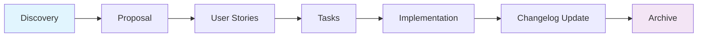

# QuinotoSpec: Yggdrasil Edition

<div align="center">


**ESTADO: PRODUCCION / ESTABLE**

Metodologia y sistema de configuracion de agentes para desarrollo asistido por IA.
Flujo de trabajo "Proposal First" / "Context Slicing" para maximizar precision y minimizar alucinaciones.


**Yggdrasil Edition** - El arbol que conecta los 9 reinos del desarrollo asistido por IA.

</div>

## Quick Start

```bash
# 1. Clonar el paquete
git clone https://github.com/Quinoto-Tech/QuinotoSpec.git
cd QuinotoSpec

# 2. Instalar para tu IDE
./install.sh --opencode --global    # OpenCode
./install.sh --cursor --global      # Cursor
./install.sh --cline --global       # Cline

# 3. En tu proyecto, ejecutar discovery
@quinotospec.discovery

# 4. Crear tu primera propuesta
@quinotospec.create-proposal
```

## Tabla de Contenido

- [El Problema](#el-problema)
- [Casos de Uso](#casos-de-uso)
- [Por Qué QuinotoSpec](#por-qué-quinotospec)
- [Instalación](#instalación)
- [Filosofía](#filosofía-proposal-first--context-slicing)
- [Flujo de Trabajo](#flujo-de-trabajo)
  - [1. Discovery](#1-discovery)
  - [2. Propuesta Técnica](#2-crear-propuesta-técnica)
  - [3. Historias de Usuario](#3-generar-historias-de-usuario)
  - [4. Tareas Técnicas](#4-generar-tareas-técnicas)
  - [5. Implementación](#5-implementación-apply)
- [Workflows](#workflows)
- [Skills](#skills)
- [Mapa de Dependencias Skills ↔ Workflows](#mapa-de-dependencias-skills--workflows)
- [Reglas](#reglas)
- [Estructura del Proyecto](#estructura-del-proyecto)
- [Solución de Problemas](#solución-de-problemas)
- [Licencia](#licencia)

---

## El Problema

Cuando los agentes de IA operan sobre un códigobase sin estructura, ocurre lo inevitable:

| Síntoma | Qué pasa | Impacto |
|---------|----------|---------|
| **Alucinaciones en cascada** | El agente no tiene contexto delinear y "inventa" decisiones de diseño | Se implementa código que no resuelve el problema real |
| **Contexto desbordado** | Se carga todo el proyecto en el prompt, pero el agente no distingue lo relevante de lo accesorio | Tokens desperdiciados, respuestas difusas, inconsistencias |
| **Cambios sin trazabilidad** | Nadie sabe qué decidió el agente, por qué, ni qué afectó | Deuda técnica invisible que crece con cada iteración |
| **Sobrescritura silenciosa** | El agente reescribe archivos enteros sin preservar trabajo previo | Se pierden historias de usuario, tareas, acuerdos de producto |
| **Onboarding ciego** | Cada sesión arranca desde cero, sin memoria del proyecto | Repetición de errores, features inconsistentes, frustración |

El resultado: promesas rotas, refactors que empeoran las cosas, y equipos que desconfían del agente porque "no sigue lo que se le pide".

La causa raíz no es el modelo — es la **ausencia de un contrato estructurado** entre humano y agente.

---

## Casos de Uso

### Proyecto nuevo con IA desde el día uno

Estás arrancando un proyecto y querés que el agente construya sobre fundamentos sólidos desde la primera línea de código. Ejecutás `@quinotospec.discovery`, el agente mapea el stack y genera los 8 archivos de contexto. A partir de ahí, cada propuesta, historia y tarea parte de una base documentada y validable — no de suposiciones.

### Proyecto desde cero con scaffold automático

El directorio está vacío — ni una línea de código. Ejecutás `@quinotospec.init`, el agente detecta que no hay proyecto y lanza un wizard interactivo: ¿lenguaje? ¿framework? ¿testing? ¿base de datos? Elegís Python + FastAPI + Poetry + pytest + SQLite. El agente ejecuta `poetry new`, instala dependencias, crea `.gitignore`, `README.md` y la estructura `.quinoto-spec/`. También acepta `--stack python:fastapi:poetry:pytest:sqlite` para ir directo sin wizard.

### Incorporación de un desarrollador al proyecto

Un nuevo miembro del equipo necesita entender el códigobase rápido. `@quinotospec.onboard developer` genera un documento de onboarding técnico: arquitectura, endpoints, deuda técnica, convenciones. El developer productivo en horas, no en semanas.

### Migración o refactor de módulos críticos

Tenés un módulo con alta deuda técnica que necesita reescritura. En lugar de pedirle al agente "refactorea esto" y cruzar los dedos, creás una propuesta con `@quinotospec.create-proposal`, desglosás en historias de usuario, generás tareas atómicas, y el agente ejecuta una por una con contexto preciso. Si algo falla, hay rollback y changelog.

### Proyecto multi-servicio con dependencias cruzadas

Tu proyecto tiene 3 servicios que se comunican entre sí. El contexto global es enorme y confuso. `@quinotospec.stack-discovery` consolida el discovery de todos los servicios, y `@quinotospec.dependency-graph` mapea las dependencias inter-servicio. El agente opera con claridad sobre qué afecta cada cambio.

### Sprint con múltiples tareas paralelas

Tenés 15 tareas que necesitan avanzar en paralelo. `@quinotospec.battle-frenzy` lanza subagentes en paralelo, cada uno con su contexto aislado. `Blood-Bond` analiza tus patrones de trabajo y predice qué tarea deberías encarar después.

### Auditoría de lo que hizo el agente

Necesitás saber qué cambió, por qué, y si cumple los criterios de aceptación. `@quinotospec.review` revisa branch/PR contra las historias de usuario. `@quinotospec-metrics` calcula compliance. El changelog se actualiza automáticamente — nunca se edita manualmente.

---

## Por Qué QuinotoSpec

### Proposal First, no Prompt First

La mayoría de los workflows con IA siguen el patrón "pedí, esperá, verificá". QuinotoSpec invierte el orden: **primero se define qué se quiere (propuesta), después se ejecuta**. Esto elimina el principal fuente de errores — la ambigüedad del prompt inicial.

### Context Slicing, no Context Dumping

En lugar de cargar todo el proyecto en cada llamada al modelo, QuinotoSpec refina el contexto progresivamente:

```
Discovery (global) → Proposal (iniciativa) → Delta Specs (incremental) → User History (valor) → Task (atómico)
```

En cada paso, el agente recibe **menos contexto pero más preciso**. Menos tokens, menos ruido, menos alucinaciones.

### Delta Specs: Especificaciones Incrementales

QuinotoSpec usa **delta specs** para describir cambios al sistema. En lugar de reescribir la especificación completa cada vez:

- **ADDED**: Nuevos requerimientos que se agregan
- **MODIFIED**: Requerimientos existentes que cambian (con `Was:` y `Reason:`)
- **REMOVED**: Requerimientos que se eliminan (con `Reason:` y `Migration:`)
- **RENAMED**: Requerimientos renombrados

Al archivar una propuesta, el **engine de merge** aplica los deltas a `specs/` — el source of truth canónico del sistema, organizado por dominio/servicio. Esto hace que QuinotoSpec funcione tanto en greenfield como en brownfield.

### Trazabilidad por diseño

Cada cambio queda registrado en un changelog inmutable (regla #1: nunca editar manualmente). Cada tarea tiene un ID con prefijo registrado. Cada propuesta se archiva cuando se completa. No hay cambios fantasma.

### Gobernanza, no solo ejecución

QuinotoSpec no es un archivo de prompts — es un **sistema de reglas**. 12 reglas estrictas que el agente debe cumplir, validables con `@quinotospec-validate` y `/quinotospec-rules-enforce`. Si un acuerdo de producto está vacío, el workflow se bloquea. Si un prefijo no está registrado, no se avanza.

### Funciona con tu agente, no en lugar de tu agente

QuinotoSpec se instala en tu IDE (Cursor, OpenCode, Cline, o genérico) y opera sobre tu proyecto. No es un SaaS, no es un wrapper — es configuración + metodología + reglas que transforman cómo tu agente trabaja.

---

## Instalación

```bash
# Clonar y dar permisos
chmod +x quinotospec-package/install.sh

# Ejecutar (modo interactivo)
./quinotospec-package/install.sh

# Instalación global (en ~/.config/)
./quinotospec-package/install.sh --opencode --global
```

El instalador pregunta la ruta de destino y el IDE:

| Flag | IDE | Destino |
|------|-----|---------|
| `--opencode` | OpenCode | `.opencode/` o `~/.config/opencode/` (global) |
| `--cursor` | Cursor | `.cursor/` o `~/.config/cursor/` (global) |
| `--global`, `--root` | - | Instala en `~/.config/` ignorando el directorio del proyecto |
| (default) | Genérico | `.agent/` |

### Instalación Global

Para instalar una vez y disponible en todos tus proyectos:

```bash
# OpenCode global
./quinotospec-package/install.sh --opencode --global

# Cursor global
./quinotospec-package/install.sh --cursor --global
```

Esto crea la configuración en `~/.config/opencode/` o `~/.config/cursor/` según el IDE.

### Dependencias

| Dependencia | Requerido | Propósito |
|-------------|-----------|-----------|
| Bash 4.0+ | Sí | Ejecutar instalador |
| Git | Sí | Control de versiones |

---

## Filosofía: "Proposal First" & "Context Slicing"

1. **Proposal First**: Antes de escribir código, escribe una propuesta. Evita código espagueti y asegura diseño aprobado.

2. **Context Slicing**: El contexto se refina progresivamente:
   - **Discovery** → Contexto Global (todo el proyecto)
   - **Proposal** → Contexto de la Iniciativa (solo lo relevante)
   - **User Histories** → Contexto del Valor (qué y para quién)
   - **Task** → Contexto Atómico (instrucciones precisas)

---

## Flujo de Trabajo

```
Discovery → Propuesta → Historias de Usuario → Tareas → Implementación → Changelog → Archive
```

### 1. Discovery

Genera documentación del estado actual del proyecto.

```bash
@quinotospec.discovery                          # Discovery completo (8 archivos)
@quinotospec.stack-detect                       # Detectar stack tecnológico
@quinotospec.stack-discovery                    # Discovery multi-servicio
@quinotospec.refresh-discovery                  # Actualizar solo archivos cambiados
```

**Output**: `.quinoto-spec/discovery/` (8 archivos Markdown).

### 2. Crear Propuesta Técnica

Define la solución a alto nivel.

```bash
@quinotospec.create-proposal
```

**Output**: `.quinoto-spec/proposals/{slug}/proposal.md`

### 3. Generar Historias de Usuario

Desglosa la propuesta en requerimientos de valor.

```bash
@quinotospec.create-user-stories --slug {SLUG}
```

**Output**: `.quinoto-spec/proposals/{slug}/user-stories.md`

### 4. Generar Tareas Técnicas

Convierte historias en pasos ejecutables.

```bash
@quinotospec.create-tasks --slug {SLUG}                    # Todas las historias
@quinotospec.create-tasks --slug {SLUG} --single {US_ID}  # Una historia
```

**Output**: `.quinoto-spec/proposals/{slug}/{US_ID}_tasks.md`

### 5. Implementación (Apply)

Ejecuta las tareas una por una.

```bash
@quinotospec.apply --task-id {TASK_ID}
```

Acciones: Lee contexto → Confirma branch → Implementa → Ejecuta tests → Actualiza changelog → Sugiere siguiente tarea.

---

## Workflows

| Workflow | Comando | Descripción |
|----------|---------|-------------|
| **Discovery** | `@quinotospec.discovery` | Genera 8 archivos de documentación del proyecto |
| **Stack Detect** | `@quinotospec.stack-detect` | Identifica stack tecnológico (lenguajes, frameworks, tests) |
| **Stack Discovery** | `@quinotospec.stack-discovery` | Discovery consolidado para proyectos multi-servicio |
| **Refresh Discovery** | `@quinotospec.refresh-discovery` | Actualiza solo archivos de discovery afectados |
| **Create Proposal** | `@quinotospec.create-proposal` | Crea propuesta técnica con prefijo único e idempotente |
| **Create PRD** | `@quinotospec.create-prd` | Crea un Product Requirements Document |
| **Create RFC** | `@quinotospec.create-rfc` | Crea un RFC interactivo con proposal seed (compatible con create-tasks) |
| **Create User Stories** | `@quinotospec.create-user-stories` | Genera historias de usuario desde propuesta |
| **Create Tasks** | `@quinotospec.create-tasks` | Genera tareas técnicas desde historias de usuario |
| **Apply** | `@quinotospec.apply` | Implementa una tarea técnica específica |
| **Review** | `@quinotospec.review` | Revisa branch/PR contra criterios de aceptación |
| **Archive** | `@quinotospec.archive` | Archiva propuestas, historias o tareas completadas |
| **Status** | `@quinotospec.status` | Dashboard del estado del proyecto |
| **Onboard** | `@quinotospec.onboard` | Genera documento de onboarding por rol |
| **Agent Train** | `@quinotospec.agent-train` | Crea agentes personalizados con sugerencias de modelo |
| **Blood-Bond** | `@quinotospec.blood-bond` | Predicción proactiva basada en patrones de trabajo |
| **Battle Frenzy** | `@quinotospec.battle-frenzy` | Ejecución paralela de múltiples tareas masivas |
| **Mjolnir Refactor** | `@quinotospec.mjolnir-refactor` | Reescritura agresiva de módulos con alta deuda técnica |
| **Dependency Graph** | `@quinotospec.dependency-graph` | Mapa de dependencias inter-servicio y contract drift |
| **Distribute** | `@quinotospec.distribute` | Distribuye artefactos a microservicios |
| **Sprint Init** | `@quinotospec.sprints.init` | Inicializa estructura de sprints |
| **Sprint Create** | `@quinotospec.sprint.create` | Crea un nuevo sprint con configuración |
| **Sprint Plan** | `@quinotospec.sprint.plan` | Genera plan de sprint óptimo |
| **Heimdallr** | `@quinotospec.heimdallr` | Análisis de amenazas STRIDE + DREAD con mitigaciones |
| **Pre-commit** | `@quinotospec.pre-commit` | Check rápido pre-commit (tests + validate + rules) |
| **Release** | `@quinotospec.release` | Automatiza version bump, consolidación de changelog y tagging |
| **Init** | `@quinotospec.init` | Inicializa estructura `.quinoto-spec/` desde cero. Si el proyecto está vacío, ofrece wizard interactivo para generar scaffold con el stack deseado |
| **Specs Init** | `@quinotospec.specs-init` | Inicializa `specs/` con requerimientos desde discovery o propuestas existentes |
| **Schema Fork** | `@quinotospec.schema-fork` | Crea schema YAML personalizado del DAG de artefactos |
| **Party Mode** | `@quinotospec.party-mode` | Mesa redonda multi-agente — debate en caracter entre agentes especializados |
| **Changelog View** | `@quinotospec.changelog-view` | Ver changelog consolidado (v2 + v1) con filtros |
| **Retrospective** | `@quinotospec.retrospective` | Retrospectiva con métricas y patrones de propuestas completadas |
| **Health** | `@quinotospec.health` | Detecta archivos huérfanos e inconsistencias en `.quinoto-spec/` |
| **Cleanup** | `@quinotospec.cleanup` | Limpia branches stale, scripts temporales y propuestas inactivas |

### Detalle de Workflows Especiales

#### Sprint Planning (3 pasos)

```
@quinotospec.sprints.init      → Configuración base del equipo
@quinotospec.sprint.create     → Crear sprint con fechas y prioridades
@quinotospec.sprint.plan       → Plan de tareas asignadas
```

**Estructura generada:**
```
.quinoto-spec/sprints/
├── base-config.yml
└── sprint-001/
    ├── sprint-config.yml
    ├── sprint-plan.md
    └── proposals/
```

#### Agent Train

Sugiere modelos y tipo de agente basándose en el análisis del proyecto:

| Complejidad | Modelo Sugerido |
|-------------|-----------------|
| Baja | `opencode/big-pickle` |
| Media | `opencode-go/mimo-v2-pro` |
| Alta | `opencode-go/mimo-v2-pro` |
| Multimodal | `opencode-go/mimo-v2-omni` |

```bash
@quinotospec.agent-train --suggest               # Sugerencias automáticas
@quinotospec.agent-train --model opencode-go/mimo-v2-pro --type subagent
```

#### Battle Frenzy (Swarm Mode)

Ejecuta múltiples subagentes en paralelo para tareas masivas.

```bash
@quinotospec.battle-frenzy "Migrar 10 endpoints a v2"
@quinotospec.battle-frenzy --dry-run "Crear tests para múltiples módulos"
```

#### Party Mode (Mesa Redonda Multi-Agente)

Reune agentes especializados en una mesa redonda para discutir, debatir y colaborar en caracter.

```bash
# Mesa redonda independiente
@quinotospec.party-mode "¿Monolito o microservicios para el modulo de pagos?"
@quinotospec.party-mode "Revisar la seguridad del API" --agents security-auditor,architect

# Integrado en propuestas — el consejo debate antes de redactar
@quinotospec.create-proposal "Refactorizar capa de autenticacion" --party
@quinotospec.create-proposal "Nuevo sistema de notificaciones" --party architect,test-writer

# Integrado en RFCs — el consejo debate el contexto y la propuesta
@quinotospec.create-rfc "Feature flags en staging" --party
```

#### Blood-Bond (Predicción Proactiva)

Analiza patrones de trabajo y predice siguientes acciones.

```bash
@quinotospec.blood-bond --suggest   # Solo sugerencias
@quinotospec.blood-bond --profile   # Solo perfil de trabajo
@quinotospec.blood-bond --alerts    # Solo alertas
```

#### Onboarding (Roles)

```bash
@quinotospec.onboard developer    # Foco técnico
@quinotospec.onboard product      # Foco producto/negocio
@quinotospec.onboard support      # Foco soporte/help desk
@quinotospec.onboard general      # Vista balanceada
@quinotospec.onboard simple       # Lenguaje simple, sin jerga
```

#### Heimdallr (Análisis de Amenazas)

<div align="center">
  
</div>

Ejecuta un análisis exhaustivo de seguridad usando metodología STRIDE + DREAD.

```bash
@quinotospec.heimdallr --system "Descripción del sistema"
```

**Salida:**
- Matriz de riesgos priorizada (DREAD)
- Identificación de activos críticos y límites de confianza
- Detalle de amenazas críticas con mitigaciones accionables
- Reporte guardado en `.quinoto-spec/threat-analysis/`

#### Init (Scaffold Automático)

En un proyecto vacío, `@quinotospec.init` detecta que no hay código y ofrece wizard interactivo para elegir stack:

```bash
@quinotospec.init                                   # Wizard interactivo (proyecto vacío)
@quinotospec.init --stack python:fastapi:poetry:pytest:sqlite  # Stack directo, sin preguntas
@quinotospec.init --no-scaffold                     # Solo estructura .quinoto-spec/, sin wizard
@quinotospec.init --with-agents --stack rust:axum:cargo:stdlib:none  # Scaffold + AGENTS.md
```

**Acciones automáticas:**
- Inicializa el proyecto con el gestor de paquetes elegido
- Instala framework, testing y dependencias
- Genera `.gitignore` y `README.md` adaptados al stack
- Crea la estructura `.quinoto-spec/` base
- Si el proyecto ya tiene código, saltea el wizard y solo crea `.quinoto-spec/`

---

## Skills

### Skills Básicas

| Skill | Comando | Descripción |
|-------|---------|-------------|
| **Generate GitHub Branch** | `/quinotospec-generate-github-branch` | Crea branches con convención `feature/{TASK_ID}-descripcion` |
| **File Creation** | `/quinotospec-file-creation` | Estandariza creación de archivos y scripts temporales |
| **Stack Detect** | `/quinotospec-stack-detect` | Identifica stack desde archivos de configuración |
| **Mark Done** | `/quinotospec-mark-done` | Marca tareas completadas y archiva artefactos |
| **Update Changelog** | `/quinotospec-update-changelog` | Actualiza changelog automáticamente |
| **Validate** | `/quinotospec-validate` | Checks de sistema como precondición para workflows |

### Skills Avanzadas (Gobernanza)

| Skill | Comando | Descripción |
|-------|---------|-------------|
| **Rules Enforce** | `/quinotospec-rules-enforce` | Ejecuta y hace cumplir reglas. Modos: `strict` / `warning` |
| **Syntax Validate** | `/quinotospec-syntax-validate` | Valida sintaxis de archivos QuinotoSpec |
| **Rollback** | `/quinotospec-rollback` | Deshace cambios de workflows fallidos |
| **Metrics** | `/quinotospec-metrics` | Calcula métricas de compliance y productividad |

### Skills de Blood-Bond

| Skill | Descripción |
|-------|-------------|
| **Blood-Bond Analyzer** | Analiza patrones históricos del desarrollador |
| **Blood-Bond Monitor** | Detecta inactividad y activa predicción proactiva |
| **Blood-Bond Predictor** | Genera predicciones basadas en análisis |

### Skills de Swarm (Battle Frenzy)

| Skill | Descripción |
|-------|-------------|
| **Swarm Executor** | Ejecuta múltiples subagentes en paralelo |
| **Swarm Task Splitter** | Divide tareas masivas en chunks paralelizables |

### Skills de Onboarding

| Skill | Descripción |
|-------|-------------|
| **Onboard Developer** | Onboarding orientado a desarrolladores |
| **Onboard Product** | Onboarding orientado a producto/negocio |
| **Onboard Support** | Onboarding orientado a soporte/help desk |
| **Onboard General** | Onboarding con vista balanceada |
| **Onboard Simple** | Onboarding en lenguaje simple sin jerga |

### Skills de Extensión

| Skill | Comando | Descripción |
|-------|---------|-------------|
| **Pre-commit** | `/quinotospec-pre-commit` | Check rápido pre-commit (tests + validate + rules) |
| **Suggest Next** | `/quinotospec-suggest-next` | Sugiere la siguiente tarea a ejecutar |
| **Conflict Detector** | `/quinotospec-conflict-detector` | Detecta conflictos entre propuestas activas |
| **Estimate** | `/quinotospec-estimate` | Estima complejidad de propuestas |

### Integración Recomendada

```bash
@quinotospec-validate --full                                        # Pre-condición antes de workflows críticos
@quinotospec-syntax-validate --type proposal --slug {SLUG}          # Antes de aplicar código
@quinotospec-mark-done --task-id TSK-AUTH-001                       # Después de completar tarea
@quinotospec-metrics --dashboard                                    # Métricas para retrospectives
```

---

---

## Mapa de Dependencias Skills ↔ Workflows

| Workflow | Skills que invoca |
|----------|-------------------|
| **discovery** | `stack-detect`, `update-changelog` |
| **create-proposal** | `update-changelog` |
| **create-prd** | `mark-done` |
| **create-rfc** | *(ninguna)* |
| **create-user-stories** | `update-changelog` |
| **create-tasks** | `update-changelog` |
| **apply** | `generate-github-branch`, `update-changelog`, `mark-done`, `blood-bond-monitor` |
| **review** | `update-changelog` |
| **archive** | `update-changelog` |
| **status** | `blood-bond-analyzer`, `blood-bond-predictor`, `update-changelog` |
| **onboard** | `onboard-{role}`, `update-changelog` |
| **agent-train** | *(ninguna)* |
| **blood-bond** | `blood-bond-analyzer`, `blood-bond-predictor` |
| **battle-frenzy** | `swarm-task-splitter`, `swarm-executor` |
| **mjolnir-refactor** | `update-changelog` |
| **dependency-graph** | `update-changelog` |
| **distribute** | `update-changelog` |
| **refresh-discovery** | `update-changelog` |
| **stack-discovery** | `update-changelog` |
| **sprints.init** | *(ninguna)* |
| **sprint.create** | *(ninguna)* |
| **sprint.plan** | `update-changelog` |
| **heimdallr** | `update-changelog`, `blood-bond-monitor` |
| **pre-commit** | `syntax-validate`, `rules-enforce` |
| **release** | `update-changelog` |
| **init** | `update-changelog` |
| **retrospective** | `update-changelog` |
| **health** | `update-changelog` |
| **cleanup** | `update-changelog` |

La skill `quinotospec-update-changelog` es el núcleo de trazabilidad: 24 de 29 workflows la invocan para documentar sus acciones.

---

## Reglas

QuinotoSpec impone 12 reglas estrictas (definidas en `agent-dist/rules/quinotospec-rules.md`):

| # | Regla | Severidad | Descripción |
|---|-------|-----------|-------------|
| 1 | **Changelog** | STANDARD | Nunca editar manualmente. Usar siempre `quinotospec-update-changelog` |
| 2 | **Prefijos e IDs** | STANDARD | Todo trabajo debe estar trazado bajo un prefijo único (MNEMONICO-UUID, ej. `AUTH-a1b2`) registrado en `prefix-registry.md` |
| 3 | **Acuerdos de Producto** | BLOCKING | Verificar `08-product-and-agreements.md` antes de crear propuestas |
| 4 | **No Sobreescribir** | STANDARD | Nunca sobreescribir `user-stories.md` o `*_tasks.md`. Usar merge inteligente |
| 5 | **Validación de Archive** | STANDARD | Verificar `Estado: Completada` antes de archivar |
| 6 | **Convención de Archivado** | STANDARD | Usar carpeta `_archived/`, nunca prefijo `__` |
| 7 | **Nombrado de Branches** | STANDARD | Siempre usar formato `feature/{{TASK_ID}}-descripcion-en-kebab-case` |
| 8 | **Config Crítica** | STANDARD | Nunca modificar `base-config.yml`, `sprint-config.yml` o `mjolnir-refactor.yml` sin aprobación |
| 9 | **Validación Pre-Workflow** | BLOCKING | Ejecutar `quinotospec-validate --full` antes de workflows críticos |
| 10 | **Backup Pre-Refactor** | BLOCKING | Backup obligatorio antes de `mjolnir-refactor` |
| 11 | **Sintaxis Pre-Apply** | WARNING | Validar sintaxis de propuesta antes de aplicar tarea |
| 12 | **Archivos Archivados** | BLOCKING | Nunca modificar archivos en `_archived/` sin aprobación explícita |

---

## Estructura del Proyecto

Después de ejecutar `@quinotospec.discovery`:

```
.tu-proyecto/
├── .quinoto-spec/
│   ├── discovery/                    # 8 archivos de documentación
│   │   ├── 01-stack-profile.md
│   │   ├── 02-overview.md
│   │   ├── 03-architecture.md
│   │   ├── 04-endpoints-and-openapi.md
│   │   ├── 05-data-and-services.md
│   │   ├── 06-devops-ci-security.md
│   │   ├── 07-findings-and-recommendations.md
│   │   └── 08-product-and-agreements.md
│   ├── proposals/                    # Propuestas técnicas
│   │   └── 2024-04-15-auth-jwt/
│   │       ├── proposal.md
│   │       ├── user-stories.md
│   │       ├── US-AUTH-001_tasks.md
│   │       └── _archived/
│   ├── sprints/                      # Planificación
│   │   ├── base-config.yml
│   │   └── sprint-001/
│   │       ├── sprint-config.yml
│   │       ├── sprint-plan.md
│   │       └── proposals/
│   ├── agents/                       # Agentes personalizados
│   ├── docs/                         # Documentación extraída
│   ├── blood-bond/                   # Análisis predictivo
│   ├── swarm/                        # Ejecución paralela
│   ├── scripts/                      # Scripts temporales
│   ├── changelog/                     # Historial auto-generado (v2)
│   │   ├── YYYY-MM-DD-PREFIX-slug.md
│   │   └── INDEX.md (gitignored)
│   ├── prefix-registry.md            # Registro de prefijos
│   └── quinoto-spec-changelog.md     # Historial v1 legacy (opcional)
├── src/
├── tests/
├── package.json
└── AGENTS.md
```

### Archivos Clave

| Archivo | Propósito |
|---------|-----------|
| `01-stack-profile.md` | Stack tecnológico detectado |
| `08-product-and-agreements.md` | DoR/DoD del equipo |
| `prefix-registry.md` | Registro de prefijos (`AUTH`, `PAY`, `USER`) |
| `proposal.md` | Propuesta técnica |
| `user-stories.md` | Historias de usuario |
| `*_tasks.md` | Tareas técnicas |

### Flujo de Archivos


```mermaid
graph LR
    A[Discovery] --> B[Proposal]
    B --> C[User Stories]
    C --> D[Tasks]
    D --> E[Implementation]
    E --> F[Changelog Update]
    F --> G[Archive]
    
    style A fill:#e1f5fe
    style G fill:#f3e5f5
```

---

## Solución de Problemas

### Problemas de Instalación

| Problema | Solución |
|----------|----------|
| "Permission denied" | `chmod +x quinotospec-package/install.sh` |
| "Bash not found" | `sudo apt install bash` o `brew install bash` |
| "Git not found" | `sudo apt install git` o `brew install git` |

### Problemas de Ejecución

| Problema | Solución |
|----------|----------|
| "No se encontró .quinoto-spec/discovery/" | Ejecutar `@quinotospec.discovery` primero |
| "Prefijo no registrado" | Registrar con `@quinotospec.create-proposal` |
| "Changelog desactualizado" | Ejecutar `@quinotospec-update-changelog` |
| Workflows no reconocidos | Reinstalar con flag correcto (`--opencode`, `--cursor`, `--cline`) |

### Comandos de Diagnóstico

```bash
@quinotospec-validate --full                     # Verificar estado del sistema
@quinotospec-syntax-validate --type all           # Validar sintaxis de archivos
@quinotospec-stack-detect                        # Detectar stack
@quinotospec.status                              # Dashboard del proyecto
```

---

## Roadmap

**Possessed Edition (v2.0.0)** — Estable / Produccion
- ✅ Blood-Bond: Prediccion proactiva
- ✅ Battle Frenzy: Ejecucion paralela
- ✅ Mjolnir Refactor: Reescritura de modulos
- ✅ Code Review Workflow
- ✅ Sprint Planning
- ✅ Validate / Syntax Validate
- ✅ Refresh Discovery / Dependency Graph
- ✅ Agent Train
- ✅ Create PRD / Create RFC
- ✅ Pre-commit / Release / Init / Retrospective / Health / Cleanup

**Berserker Edition (v2.1.0)** — Completada
- ✅ 9 agentes especializados pre-configurados
- ✅ 12 reglas de gobernanza (4 nuevas BLOCKING/WARNING)
- ✅ Skills avanzadas: search, stats, diff, sync
- ✅ Workflows: migrate, backup, export, import
- ✅ Test suite completa con validacion automatica
- ✅ Install.sh mejorado con --verify, --uninstall, --version
- ✅ CI/CD con GitHub Actions
- ✅ Scripts de automatizacion
- ✅ Documentacion extendida (docs/)
- ✅ Proyectos de ejemplo (examples/)

**Yggdrasil Edition (v2.1.0)** — Actual
- ✅ 9 agentes especializados (architect, code-reviewer, test-writer, security-auditor, devops-engineer, debugger, refactor-specialist, doc-writer, performance-optimizer)
- ✅ Sistema de gobernanza con 12 reglas
- ✅ Infraestructura de testing y CI/CD
- ✅ Documentacion completa y ejemplos
- ✅ Integracion con GitHub Issues y Jira CSV

**Warband: Falange (v3.0.0, TBA)**
-  Class System: Roles especializados (~60%) — 9 agentes especializados existen, falta sistema de progresión y nombres mitológicos (Scout/Skald/Blacksmith)
- 🟡 Shield Wall: Testing defensivo (~50%) — Validación en capas existe (pre-commit, validate, rules), falta validación cruzada entre agentes
- 🟡 Integración con PMs externos (Jira, Linear, GitHub Issues) (~55%) — Specs para import/export existen, faltan adapters de API live y sync bidireccional
- 🔴 JSON Schema para validación de propuestas y tasks (~5%) — Validación por patrones existe, cero schemas JSON formales

**Warband: Hird (v4.0.0, TBA)**
- 🟡 War Council: Resolución de conflictos (~40%) — Detección con 4 niveles de severidad existe, falta ejecución de resolución y mediación
- 🟡 Alliance Integration: Multi-repo (~55%) — Sync skill, stack-discovery y dependency-graph existen, falta contexto federado y soporte remoto

---

## Licencia

MIT License. Ver [LICENSE](LICENSE) para detalles.

Contribuciones bienvenidas: [CONTRIBUTING.md](CONTRIBUTING.md)