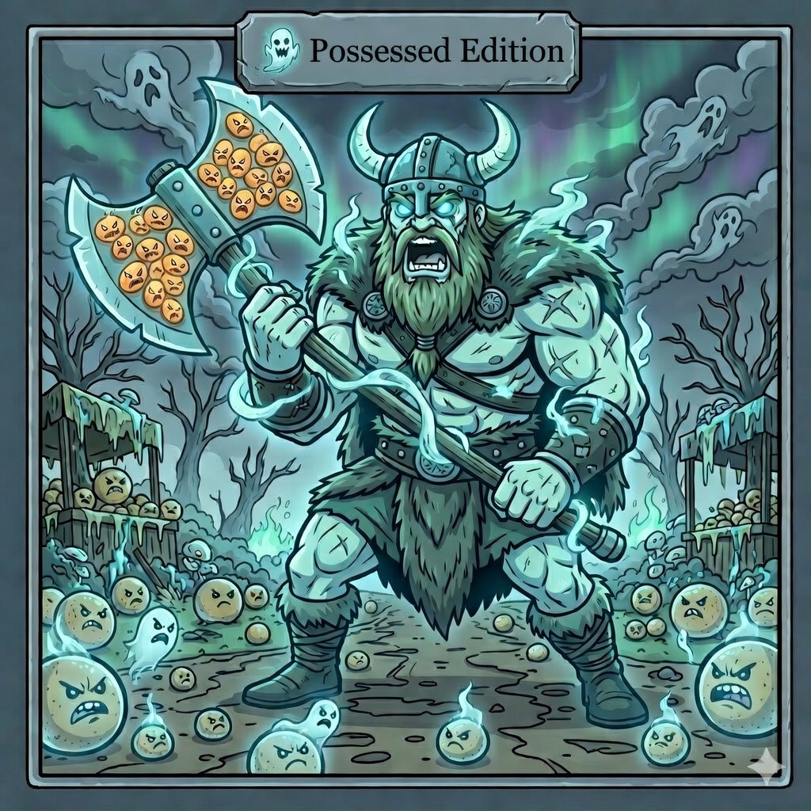
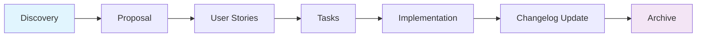

# QuinotoSpec: Possessed Edition

> **STATUS: PRODUCTION / STABLE**
> Methodology and agent configuration system for AI-assisted development.
> "Proposal First" / "Context Slicing" workflow to maximize accuracy and minimize hallucinations.

<div align="center">
  
</div>

## Table of Contents

- [The Problem](#the-problem)
- [Use Cases](#use-cases)
- [Why QuinotoSpec](#why-quinotospec)
- [Installation](#installation)
- [Philosophy](#philosophy-proposal-first--context-slicing)
- [Workflow](#workflow)
  - [1. Discovery](#1-discovery)
  - [2. Create Technical Proposal](#2-create-technical-proposal)
  - [3. User Stories](#3-generate-user-stories)
  - [4. Technical Tasks](#4-generate-technical-tasks)
  - [5. Implementation](#5-implementation-apply)
- [Workflows](#workflows)
- [Skills](#skills)
- [Rules](#rules)
- [Project Structure](#project-structure)
- [Troubleshooting](#troubleshooting)
- [License](#license)

---

## The Problem

When AI agents operate on an unstructured codebase, the inevitable happens:

| Symptom | What Happens | Impact |
|---------|-------------|--------|
| **Cascade hallucinations** | The agent lacks delineated context and "invents" design decisions | Code gets implemented that misses the real problem |
| **Context overflow** | The entire project is loaded into the prompt, but the agent can't distinguish relevant from accessory | Wasted tokens, vague responses, inconsistencies |
| **Untraceable changes** | Nobody knows what the agent decided, why, or what it affected | Invisible tech debt growing with each iteration |
| **Silent overwrites** | The agent rewrites entire files without preserving prior work | Lost user stories, tasks, product agreements |
| **Blind onboarding** | Each session starts from scratch, with no project memory | Repeated errors, inconsistent features, frustration |

The result: broken promises, refactors that make things worse, and teams that distrust the agent because "it doesn't follow what was asked."

The root cause is not the model — it is the **absence of a structured contract** between human and agent.

---

## Use Cases

### New project with AI from day one

You're starting a project and want the agent to build on solid foundations from the very first line of code. You run `@quinotospec.discovery`, the agent maps the stack and generates 8 context files. From there, every proposal, story, and task stems from a documented, verifiable base — not assumptions.

### Developer onboarding to the project

A new team member needs to understand the codebase fast. `@quinotospec.onboard developer` generates a technical onboarding document: architecture, endpoints, tech debt, conventions. Productive in hours, not weeks.

### Critical module migration or refactor

You have a high-debt module that needs rewriting. Instead of asking the agent to "refactor this" and crossing your fingers, you create a proposal with `@quinotospec.create-proposal`, break it down into user stories, generate atomic tasks, and the agent executes them one by one with precise context. If something fails, there's rollback and changelog.

### Multi-service project with cross-dependencies

Your project has 3 services communicating with each other. The global context is huge and confusing. `@quinotospec.stack-discovery` consolidates discovery across all services, and `@quinotospec.dependency-graph` maps inter-service dependencies. The agent operates with clarity on what each change affects.

### Sprint with multiple parallel tasks

You have 15 tasks that need to advance in parallel. `@quinotospec.battle-frenzy` launches subagents in parallel, each with its isolated context. Blood-Bond analyzes your work patterns and predicts which task you should tackle next.

### Audit of what the agent did

You need to know what changed, why, and whether it meets acceptance criteria. `@quinotospec.review` checks branch/PR against user stories. `@quinotospec-metrics` calculates compliance. The changelog updates automatically — never edited manually.

---

## Why QuinotoSpec

### Proposal First, not Prompt First

Most AI workflows follow the "ask, wait, verify" pattern. QuinotoSpec reverses the order: **first define what you want (proposal), then execute.** This eliminates the primary source of errors — the ambiguity of the initial prompt.

### Context Slicing, not Context Dumping

Instead of loading the entire project into every model call, QuinotoSpec refines context progressively:

```
Discovery (global) → Proposal (initiative) → User Story (value) → Task (atomic)
```

At each step, the agent receives **less context but more precise**. Fewer tokens, less noise, fewer hallucinations.

### Traceability by Design

Every change is recorded in an immutable changelog (rule #1: never edit manually). Every task has an ID with a registered prefix. Every proposal is archived when completed. No ghost changes.

### Governance, not just Execution

QuinotoSpec is not a prompt file — it's a **rule system**. 7 strict rules that the agent must follow, validated with `@quinotospec-validate` and `/quinotospec-rules-enforce`. If a product agreement is empty, the workflow blocks. If a prefix is not registered, progress stops.

### Works with your agent, not instead of your agent

QuinotoSpec installs into your IDE (Cursor, OpenCode, Cline, or generic) and operates on your project. It's not a SaaS, not a wrapper — it's configuration + methodology + rules that transform how your agent works.

---

## Installation

```bash
# Clone and set permissions
chmod +x quinotospec-package/install.sh

# Run (interactive mode)
./quinotospec-package/install.sh
```

The installer prompts for destination path and IDE:

| Flag | IDE | Destination |
|------|-----|-------------|
| `--opencode` | OpenCode | `.opencode/` |
| `--cursor` | Cursor | `.cursor/` |
| `--cline` | Cline | `.cline/` + `.clinerules/` |
| (default) | Generic | `.agent/` |

### Dependencies

| Dependency | Required | Purpose |
|------------|----------|---------|
| Bash 4.0+ | Yes | Run installer |
| Git | Yes | Version control |
| Python 3.8+ | Optional | Advanced skills (pdfplumber) |
| pip | Optional | Python packages |

---

## Philosophy: "Proposal First" & "Context Slicing"

1. **Proposal First**: Before writing code, write a proposal. Prevents spaghetti code and ensures approved design.

2. **Context Slicing**: Context is progressively refined:
   - **Discovery** → Global Context (entire project)
   - **Proposal** → Initiative Context (only what's relevant)
   - **User Histories** → Value Context (what and for whom)
   - **Task** → Atomic Context (precise instructions)

---

## Workflow

```
Discovery → Proposal → User Stories → Tasks → Implementation → Changelog → Archive
```

### 1. Discovery

Generates documentation of the project's current state.

```bash
@quinotospec.discovery                          # Full discovery (8 files)
@quinotospec-stack-detect                       # Detect tech stack
@quinOTOSpec.stack-discovery                    # Multi-service discovery
@quinotospec.refresh-discovery                  # Update only changed files
```

**Output**: `.quinoto-spec/discovery/` (8 Markdown files).

### 2. Create Technical Proposal

Defines the high-level solution.

```bash
@quinotospec.create-proposal
```

**Output**: `.quinoto-spec/proposals/{slug}/proposal.md`

### 3. Generate User Stories

Breaks down the proposal into value requirements.

```bash
@quinotospec.create-user-stories --slug {SLUG}
```

**Output**: `.quinoto-spec/proposals/{slug}/user-stories.md`

### 4. Generate Technical Tasks

Converts stories into executable steps.

```bash
@quinotospec.create-tasks --slug {SLUG}                    # All stories
@quinotospec.create-tasks --slug {SLUG} --single {US_ID}  # Single story
```

**Output**: `.quinoto-spec/proposals/{slug}/{US_ID}_tasks.md`

### 5. Implementation (Apply)

Executes tasks one by one.

```bash
@quinotospec.apply --task-id {TASK_ID}
```

Actions: Reads context → Confirms branch → Implements → Runs tests → Updates changelog → Suggests next task.

---

## Workflows

| Workflow | Command | Description |
|----------|---------|-------------|
| **Discovery** | `@quinotospec.discovery` | Generates 8 project documentation files |
| **Stack Detect** | `@quinotospec-stack-detect` | Identifies tech stack (languages, frameworks, tests) |
| **Stack Discovery** | `@quinotospec.stack-discovery` | Consolidated discovery for multi-service projects |
| **Refresh Discovery** | `@quinotospec.refresh-discovery` | Updates only affected discovery files |
| **Create Proposal** | `@quinotospec.create-proposal` | Creates technical proposal with sequential prefix |
| **Create User Stories** | `@quinotospec.create-user-stories` | Generates user stories from proposal |
| **Create Tasks** | `@quinotospec.create-tasks` | Generates technical tasks from user stories |
| **Apply** | `@quinotospec.apply` | Implements a specific technical task |
| **Review** | `@quinotospec.review` | Reviews branch/PR against acceptance criteria |
| **Archive** | `@quinotospec.archive` | Archives completed proposals, stories, or tasks |
| **Status** | `@quinotospec.status` | Project status dashboard |
| **Onboard** | `@quinotospec.onboard` | Generates onboarding document by role |
| **Agent Train** | `@quinotospec.agent-train` | Creates custom agents with model suggestions |
| **Blood-Bond** | `@quinotospec.blood-bond` | Proactive prediction based on work patterns |
| **Battle Frenzy** | `@quinotospec.battle-frenzy` | Parallel execution of multiple massive tasks |
| **Mjolnir Refactor** | `@quinotospec.mjolnir-refactor` | Aggressive rewrite of modules with high technical debt |
| **Dependency Graph** | `@quinotospec.dependency-graph` | Inter-service dependency map and contract drift |
| **Distribute** | `@quinotospec.distribute` | Distributes artifacts to microservices |
| **Sprint Init** | `@quinotospec.sprints.init` | Initializes sprint structure |
| **Sprint Create** | `@quinotospec.sprint.create` | Creates a new sprint with configuration |
| **Sprint Plan** | `@quinotospec.sprint.plan` | Generates optimal sprint plan |

### Special Workflows Detail

#### Sprint Planning (3 steps)

```
@quinotospec.sprints.init      → Base team configuration
@quinotospec.sprint.create     → Create sprint with dates and priorities
@quinotospec.sprint.plan       → Assigned task plan
```

**Generated structure:**
```
.quinoto-spec/sprints/
├── base-config.yml
└── sprint-001/
    ├── sprint-config.yml
    ├── sprint-plan.md
    └── proposals/
```

#### Agent Train

Suggests models and agent types based on project analysis:

| Complexity | Suggested Model |
|------------|-----------------|
| Low | `opencode/big-pickle` |
| Medium | `opencode-go/mimo-v2-pro` |
| High | `opencode-go/mimo-v2-pro` |
| Multimodal | `opencode-go/mimo-v2-omni` |

```bash
@quinotospec.agent-train --suggest               # Automatic suggestions
@quinotospec.agent-train --model opencode-go/mimo-v2-pro --type subagent
```

#### Battle Frenzy (Swarm Mode)

Runs multiple subagents in parallel for massive tasks.

```bash
@quinotospec.battle-frenzy "Migrate 10 endpoints to v2"
@quinotospec.battle-frenzy --dry-run "Create tests for multiple modules"
```

#### Blood-Bond (Proactive Prediction)

Analyzes work patterns and predicts next actions.

```bash
@quinotospec.blood-bond --suggest   # Suggestions only
@quinotospec.blood-bond --profile   # Work profile only
@quinotospec.blood-bond --alerts    # Alerts only
```

#### Onboarding (Roles)

```bash
@quinotospec.onboard developer    # Technical focus
@quinotospec.onboard product       # Product/business focus
@quinotospec.onboard support       # Support/help desk focus
@quinotospec.onboard general       # Balanced view
@quinotospec.onboard simple        # Simple language, no jargon
```

---

## Skills

### Basic Skills

| Skill | Command | Description |
|-------|---------|-------------|
| **Generate GitHub Branch** | `/generate-github-branch` | Creates branches with `feature/{TASK_ID}-description` convention |
| **File Creation** | `/quinotospec-file-creation` | Standardizes file creation and temp scripts |
| **Stack Detect** | `/quinotospec-stack-detect` | Identifies stack from configuration files |
| **Mark Done** | `/quinotospec-mark-done` | Marks tasks as completed and archives artifacts |
| **Update Changelog** | `/quinotospec-update-changelog` | Updates changelog automatically |
| **Validate** | `/quinotospec-validate` | System checks as preconditions for workflows |

### Advanced Skills (Governance)

| Skill | Command | Description |
|-------|---------|-------------|
| **Rules Enforce** | `/quinotospec-rules-enforce` | Enforces rules. Modes: `strict` / `warning` |
| **Syntax Validate** | `/quinotospec-syntax-validate` | Validates QuinotoSpec file syntax |
| **Rollback** | `/quinotospec-rollback` | Undoes changes from failed workflows |
| **Metrics** | `/quinotospec-metrics` | Calculates compliance and productivity metrics |

### Blood-Bond Skills

| Skill | Description |
|-------|-------------|
| **Blood-Bond Analyzer** | Analyzes historical developer patterns |
| **Blood-Bond Monitor** | Detects inactivity and triggers proactive prediction |
| **Blood-Bond Predictor** | Generates predictions based on analysis |

### Swarm Skills (Battle Frenzy)

| Skill | Description |
|-------|-------------|
| **Swarm Executor** | Runs multiple subagents in parallel |
| **Swarm Task Splitter** | Splits massive tasks into parallelizable chunks |

### Onboarding Skills

| Skill | Description |
|-------|-------------|
| **Onboard Developer** | Developer-oriented onboarding |
| **Onboard Product** | Product/business-oriented onboarding |
| **Onboard Support** | Support/help desk-oriented onboarding |
| **Onboard General** | Balanced view onboarding |
| **Onboard Simple** | Plain language onboarding without jargon |

### Recommended Integration

```bash
@quinotospec-validate --full                                        # Precondition before critical workflows
@quinotospec-syntax-validate --type proposal --slug {SLUG}          # Before applying code
@quinotospec-mark-done --task-id TSK-AUTH-001                       # After completing task
@quinotospec-metrics --dashboard                                    # Metrics for retrospectives
```

---

## Rules

QuinotoSpec enforces 8 strict rules (defined in `agent-dist/rules/quinotospec-rules.md`):

| # | Rule | Description |
|---|------|-------------|
| 1 | **Changelog** | Never edit manually. Always use `quinotospec-update-changelog` |
| 2 | **Prefixes & IDs** | All work must be tracked under a prefix registered in `prefix-registry.md` |
| 3 | **Product Agreements** | Blocking: check `08-product-and-agreements.md` before creating proposals |
| 4 | **No Overwrite** | Never overwrite `user-stories.md` or `*_tasks.md`. Use smart merge |
| 5 | **Archive Validation** | Verify `Status: Completed` before archiving |
| 6 | **Archive Convention** | Use `_archived/` folder, never `__` prefix |
| 7 | **Branch Naming** | Always use format `feature/{{TASK_ID}}-description-in-kebab-case` |
| 8 | **Critical Config** | Never modify `base-config.yml`, `sprint-config.yml`, or `mjolnir-refactor.yml` without approval |

---

## Project Structure

After running `@quinotospec.discovery`:

```
.your-project/
├── .quinoto-spec/
│   ├── discovery/                    # 8 documentation files
│   │   ├── 01-stack-profile.md
│   │   ├── 02-overview.md
│   │   ├── 03-architecture.md
│   │   ├── 04-endpoints-and-openapi.md
│   │   ├── 05-data-and-services.md
│   │   ├── 06-devops-ci-security.md
│   │   ├── 07-findings-and-recommendations.md
│   │   └── 08-product-and-agreements.md
│   ├── proposals/                    # Technical proposals
│   │   └── 2024-04-15-auth-jwt/
│   │       ├── proposal.md
│   │       ├── user-stories.md
│   │       ├── US-AUTH-001_tasks.md
│   │       └── _archived/
│   ├── sprints/                      # Planning
│   │   ├── base-config.yml
│   │   └── sprint-001/
│   │       ├── sprint-config.yml
│   │       ├── sprint-plan.md
│   │       └── proposals/
│   ├── agents/                       # Custom agents
│   ├── docs/                         # Extracted documentation
│   ├── blood-bond/                   # Predictive analysis
│   ├── swarm/                        # Parallel execution
│   ├── scripts/                      # Temp scripts
│   ├── prefix-registry.md            # Prefix registry
│   └── quinoto-spec-changelog.md     # Change history
├── src/
├── tests/
├── package.json
└── AGENTS.md
```

### Key Files

| File | Purpose |
|------|---------|
| `01-stack-profile.md` | Detected tech stack |
| `08-product-and-agreements.md` | Team DoR/DoD |
| `prefix-registry.md` | Prefix registry (`AUTH`, `PAY`, `USER`) |
| `proposal.md` | Technical proposal |
| `user-stories.md` | User stories |
| `*_tasks.md` | Technical tasks |

### File Flow



---

## Troubleshooting

### Installation Issues

| Issue | Solution |
|-------|----------|
| "Permission denied" | `chmod +x quinotospec-package/install.sh` |
| "Bash not found" | `sudo apt install bash` or `brew install bash` |
| "Git not found" | `sudo apt install git` or `brew install git` |

### Execution Issues

| Issue | Solution |
|-------|----------|
| ".quinoto-spec/discovery/ not found" | Run `@quinotospec.discovery` first |
| "Prefix not registered" | Register with `@quinotospec.create-proposal` |
| "Changelog outdated" | Run `@quinotospec-update-changelog` |
| Workflows not recognized | Reinstall with correct flag (`--opencode`, `--cursor`, `--cline`) |

### Diagnostic Commands

```bash
@quinotospec-validate --full                     # Verify system status
@quinotospec-syntax-validate --type all           # Validate file syntax
@quinotospec-stack-detect                        # Detect stack
@quinotospec.status                               # Project dashboard
```

---

## Roadmap

**Possessed Edition (Current)** — Stable / Production
- ✅ Blood-Bond: Proactive prediction
- ✅ Battle Frenzy: Parallel execution

**Berserker Edition** — Stable / Production
- ✅ Mjolnir Refactor: Module rewriting
- ✅ Code Review Workflow
- ✅ Sprint Planning
- ✅ Validate / Syntax Validate
- ✅ Refresh Discovery / Dependency Graph
- ✅ Agent Train

**Warband: Phalanx (TBA)**
- Class System: Specialized roles
- Shield Wall: Defensive testing

**Warband: Hird (TBA)**
- War Council: Conflict resolution
- Alliance Integration: Multi-repo

---

## License

MIT License. See [LICENSE](LICENSE) for details.

Contributions welcome: [CONTRIBUTING.md](CONTRIBUTING.md)