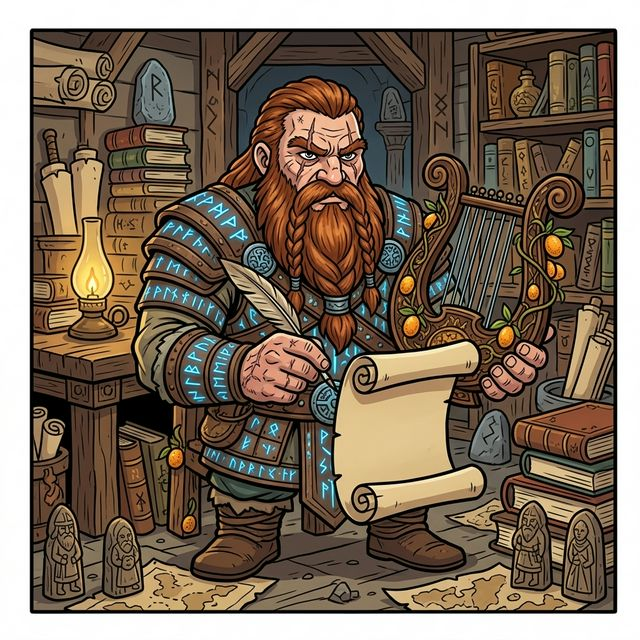

  

Este workflow activa al agente en modo **Skald**. Su objetivo es la especificación técnica y la alineación con el valor de negocio.

---

## Instrucciones del Skald

### 1. Ingesta de Contexto (Viene del Scout)
- Lee el informe del Scout y el mapa de impacto si existen.
- Si no hay contexto previo, advierte al usuario o solicita un `@quinotospec.scout`.

### 2. Forja de la Propuesta (`create-proposal`)
- Ejecuta `@quinotospec.create-proposal` asegurando que la arquitectura propuesta solucione los riesgos detectados por el Scout.
- Redacta con lenguaje técnico-funcional claro.

**🛑 CHECKPOINT**: Presentar la propuesta técnica al usuario y **esperar aprobación** para proceder a generar las historias.

### 3. Desglose de Valor (`create-user-histories`)
- Genera las Historias de Usuario asegurando que el DoD (Definition of Done) sea estricto y alineado con los Acuerdos de Producto.

**🛑 CHECKPOINT**: Presentar las Historias de Usuario al usuario y **esperar aprobación** para finalizar el rol.

---

**Reporte Final del Skald:**
Al terminar, el Skald debe confirmar:
- [ ] Propuesta técnica registrada y vinculada a un prefijo.
- [ ] Historias de Usuario trazadas a los servicios afectados.
- [ ] Instrucciones claras para el Blacksmith.
