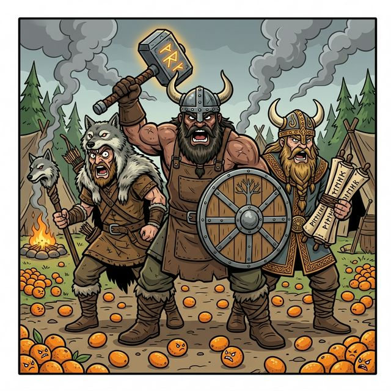

  

Este workflow activa la **Formación Falange**. El agente operará pasando por los tres roles especializados para completar una iniciativa de inicio a fin.

---

## Fases de la Warband

### Fase 1: El Scout 🔍
- **Acción**: Identifica riesgos y áreas de impacto.
- **Resultado Esperado**: `impact-map.md` y reporte de riesgos en la carpeta de implementación única.
- **🛑 CHECKPOINT**: Presentar hallazgos al usuario y **esperar aprobación** para invocar al Skald.

### Fase 2: El Skald 📜
- **Acción**: Diseña la solución y redacta las especificaciones.
- **Resultado Esperado**: `proposal.md` y `user-histories.md` en la carpeta de implementación única.
- **🛑 CHECKPOINT 1**: Presentar propuesta técnica al usuario y **esperar aprobación** para proceder a generar las historias.
- **🛑 CHECKPOINT 2**: Presentar historias de usuario al usuario y **esperar aprobación** para invocar al Blacksmith.

### Fase 3: El Blacksmith 🛠️
- **Acción**: Genera las tareas y ejecuta el código.
- **Resultado Esperado**: Código funcional, tests pasados y `changelog` actualizado.
- **🛑 CHECKPOINTS**: Seguir el protocolo de autorización **tarea por tarea** definido en `quinotospec.blacksmith.md`.

---

## Reglas de la Warband
1.  **Validación de Paso**: El agente debe solicitar confirmación al usuario al final de cada fase (Scout → Skald y Skald → Blacksmith).
2.  **Contexto Compartido**: Cada rol debe leer los artefactos generados por el anterior para mantener la coherencia.
3.  **Registro Único**: Todo el proceso se traza bajo el mismo prefix de propuesta.
4.  **Directorio de Implementación**: Cada ejecución crea sus artefactos en una carpeta única con identificador (ej: `implementations/{timestamp}-{id}/`) para manejar múltiples implementaciones simultáneamente.

---

**Reporte de Misión:**
Al finalizar la Warband, se entrega el feature completo, documentado y verificado.
